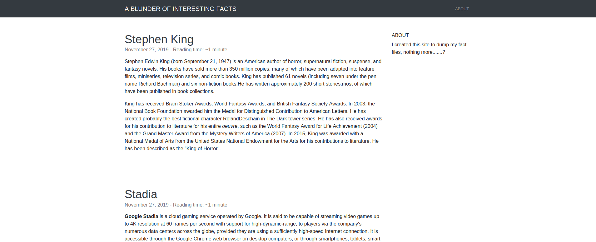

Blunder is a Linux machine. The ip of the box is 10.10.10.191.

# Recon

I starting with *nmap* scan `nmap -sC -Sv -oA nmap/cache 10.10.10.191`

And I found two services:
- *ftp*
- *webserver apache*

The FTP is closed so just check on port 80.

There is a blog with some contents, so I decide to enum with *gobuster*

`gobuster dir -w /usr/share/wordlists/dirbuster/directory-list-2.3-medium.txt -t 10 -u 10.10.10.191 -o enum.txt`

and found these directories/files:
> /about (Status: 200)
>
> /0 (Status: 200)
>
> /admin (Status: 301)
>
> /robots.txt (Status: 200)
>
> /todo.txt (Status: 200)
>
> /usb (Status: 200)

The only interesting ones are: */admin* and *todo.txt*

In todo.txt 

I found a potential user *fergus*

In /admin

found a login page.

The login page mention bludit so i googled for it. It turned out to be a CMS. I searched for any exploits and I found this [article](https://rastating.github.io/bludit-brute-force-mitigation-bypass/). The article explains how to bypass bruteforce mitigation for authentication. So I downloaded the script and replaced the user with fergus (found in todo.txt) and used a wordlist created with *cewl*. 

In this way I recover the password for the fergus user.
>**user:fergus and password:RolandDeschain**

# User
I used metasploit for uploading shell

set the params for the exploit

and run

now upgrade I shell with `python -c "import pty;pty.spawn('/bin/bash')"`

and start enumeration.
In the host there is a different version of bludit(*bludit-3.10.0a*), in this versione there is a file with user info.

This file includes hugo's password hash, the hash is a sha1 and you can get the password online

>**user:hugo and password:Password120**

now just change user and take user flag.

# Root

I execute `sudo -l`

a this point check for 

> (ALL, !root) /bin/bash

and found this [exploit](https://www.exploit-db.com/exploits/47502">https://www.exploit-db.com/exploits/47502).

So I execute `sudo -u#-1 /bin/bash`

and got root flag

