 
---
layout: default
title: Delivery
permalink: /writeup/delivery/
lang: en
---

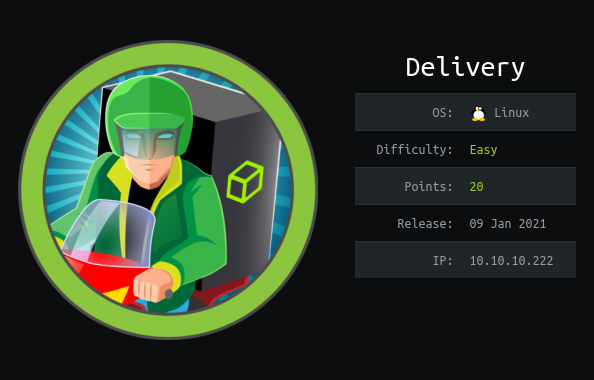

Delivery is a Linux machine. The IP of the box is 10.10.10.222.

# Recon

I start with *nmap* `nmap -sC -Sv -oA nmap/delivery 10.10.10.222`

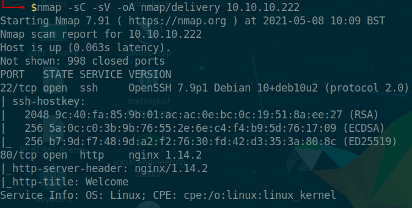

And i found:
- *ssh*
- *webserver nginx*

On port 80 there is a static site 

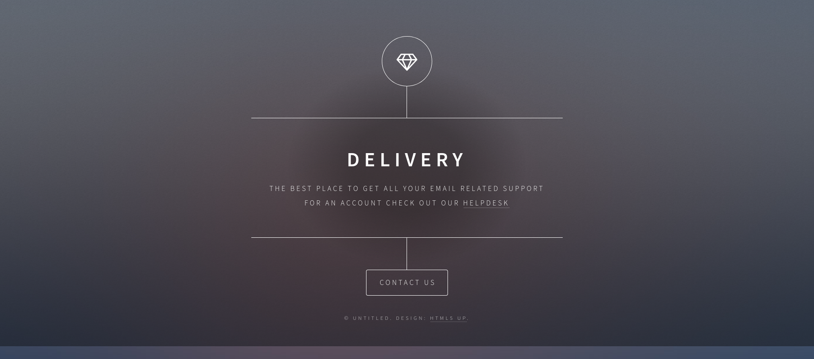

with a info page.

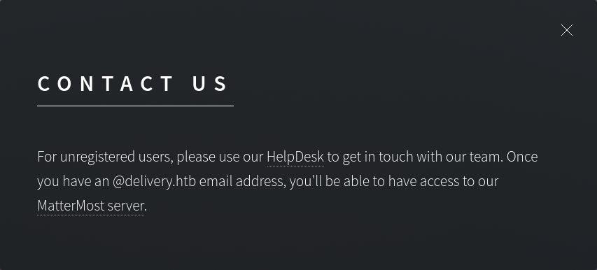

where can i found 2 link:

- http://helpdesk.delivery.htb/
- http://delivery.htb:8065/

So i added `helpdesk.delivery.htb` and `delivery.htb` in `/etc/hosts`

###### Mattermost
Now on `http://delivery.htb:8065` i can reach Mattermost.

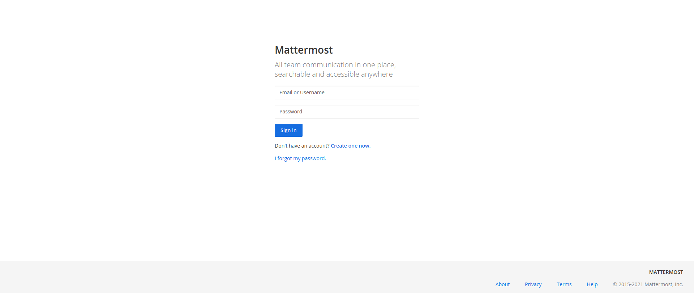

###### Helpdesk
On `http://helpdesk.delivery.htb` i can reach `OsTicket` plattform of ticketing.

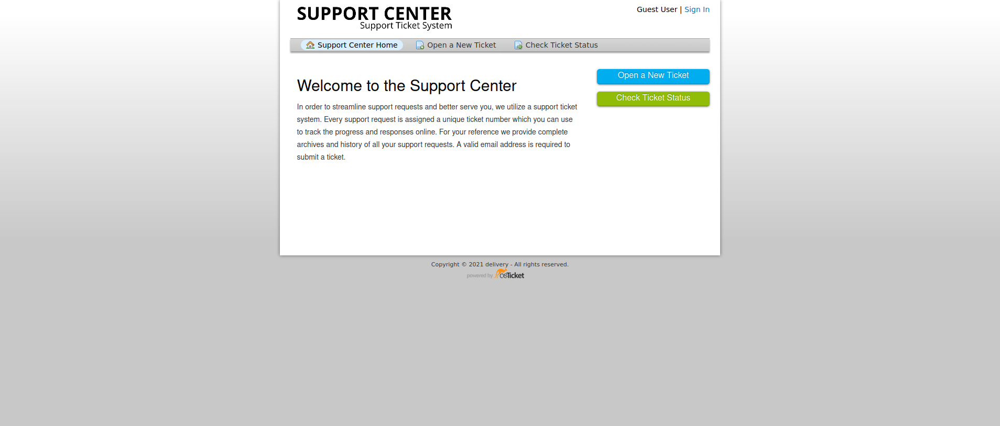

# User

From the static site i got: 

> For unregistered users, please use our HelpDesk to get in touch with our team.
> Once you have an @delivery.htb email address, you’ll be able to have access to
> our MatterMost server.

So i need to user the helpdesk for get a `@delivery.htb` email and finally register on Mattermost.

I create a new ticket on the platform

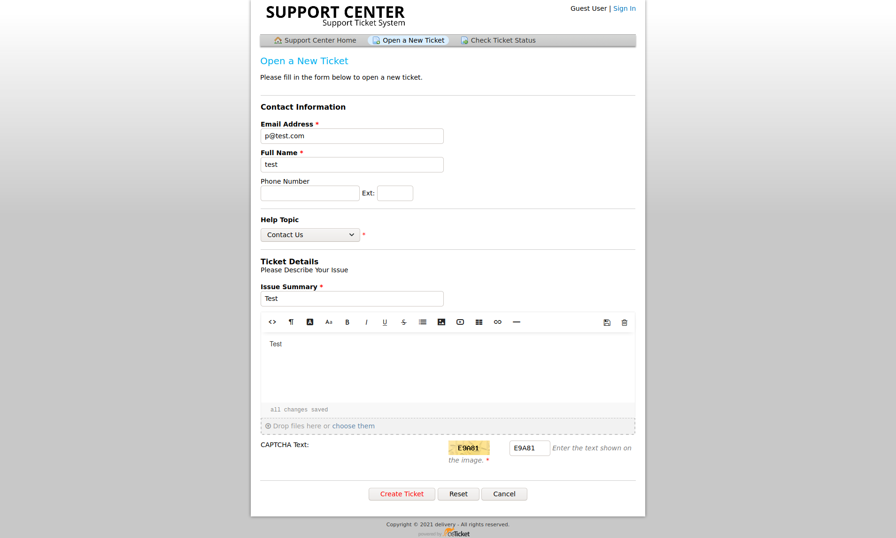

And after the creation got a `id` and a `email`
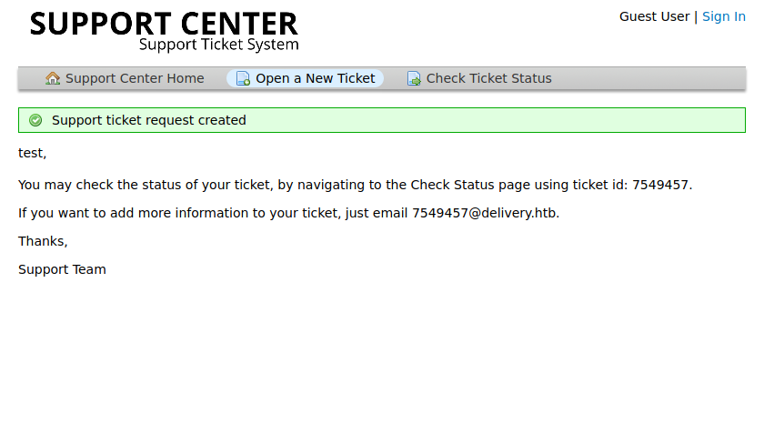

Now i can check the status of ticket

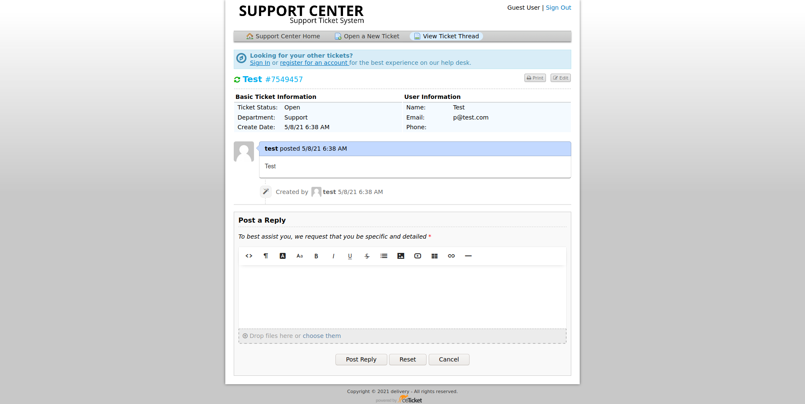

and i can try to register on Mattermost platform with the new email.

After the registration on Mattermost got a update on open ticket

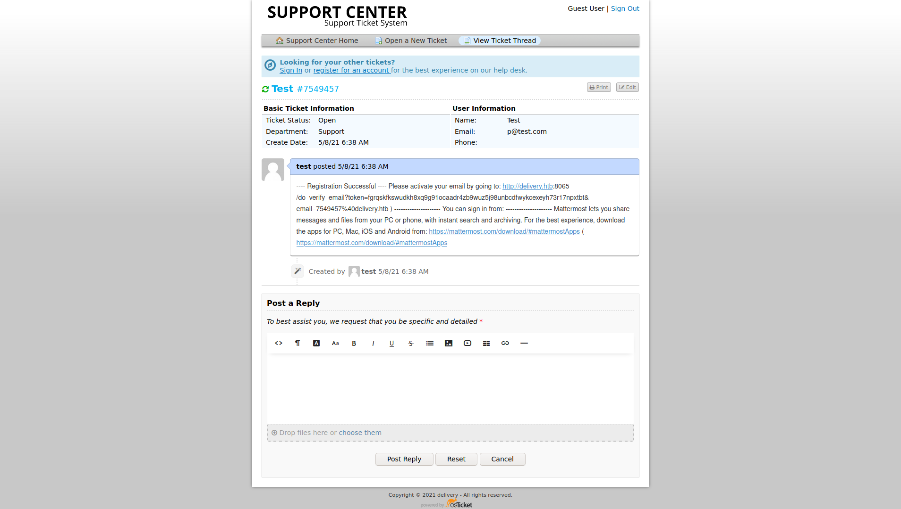

with a confirmation link for Mattermost.

After the login on Mattermost i got this page/chat

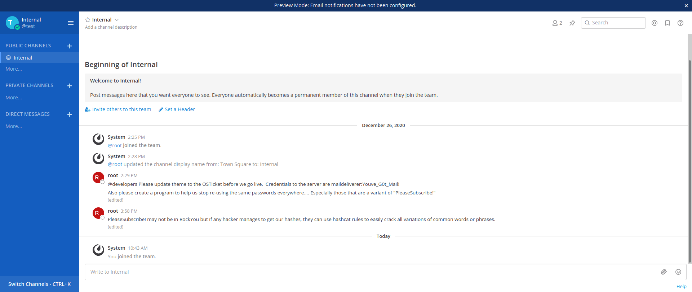

that show credentials `maildeliverer:Youve_G0t_Mail!`

So i can login as `maildeliverer` through `ssh`

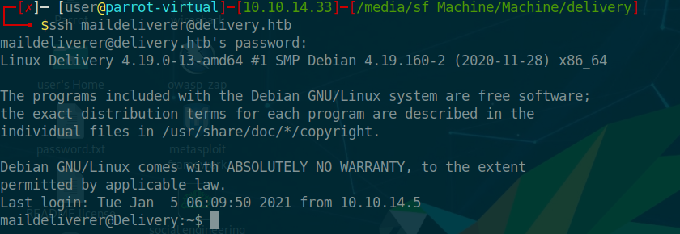

and take the user flag.

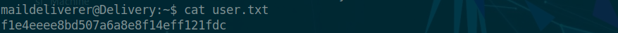

# Root
After enumeration i found the config file of Mattermost in `/opt/mattermost/config/config.json`

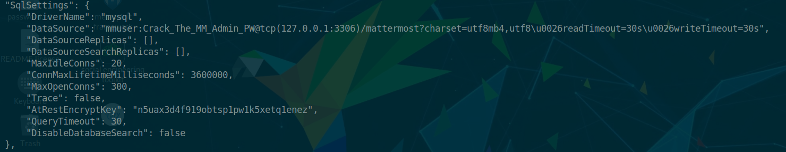

with credentials of sql.

So i access on db

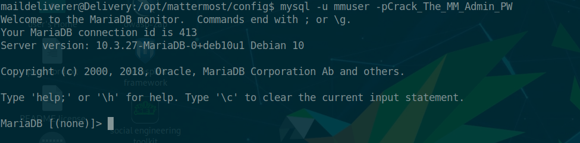

and dump the user table.

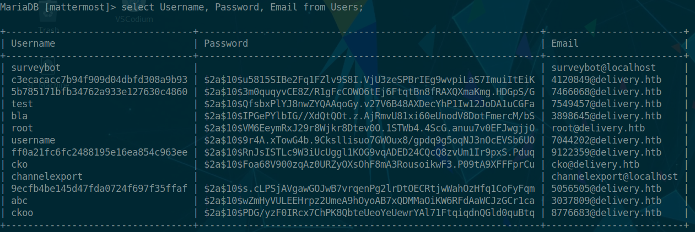

Now i need to crack the root password. The chat, on mattermost, it remembered :

> Also please create a program to help us stop re-using the same passwords
> everywhere…. Especially those that are a variant of “PleaseSubscribe!”
>
>PleaseSubscribe! may not be in RockYou but if any hacker manages to get our 
> hashes, they can use hashcat rules to easily crack all variations of common words 
> or phrases.

I launched `hashcat -a0 -m 3200 hash.txt password -r /usr/share/hashcat/rules/best64.rule -o cracked` (hash.txt contain hash of root and password contain PleaseSubscribe!)

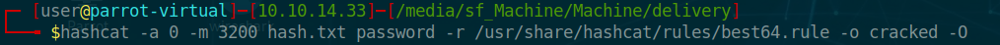

I got the password

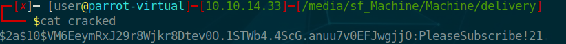

logged in as `root`

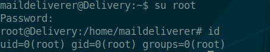

and i taked flag

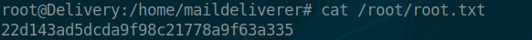

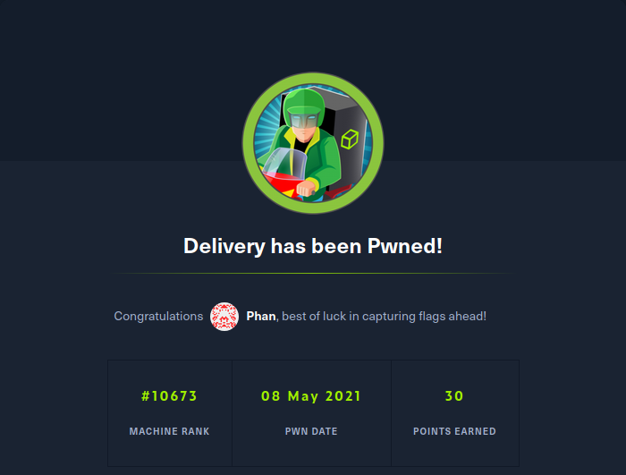
