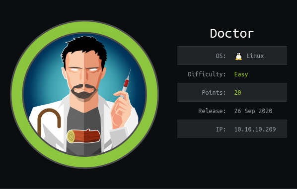

Doctor is a Linux machine. The ip of the box is 10.10.10.209.

# Recon

I start with *nmap* `nmap -sC -Sv -oA nmap/doctor 10.10.10.209`

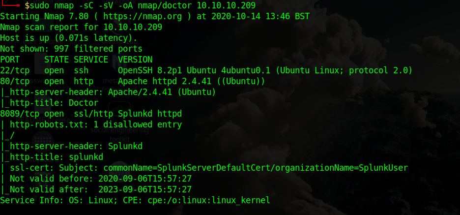

And found three services:
- *ssh*
- *webserver apache*
- *Splunk*

So i enum the port 80 and found a login page.

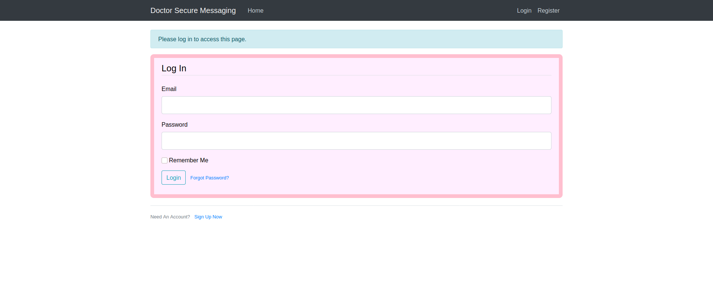

and a register page.

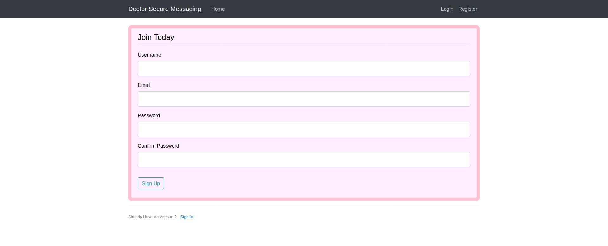

I can create a new user and then login and can create posts.
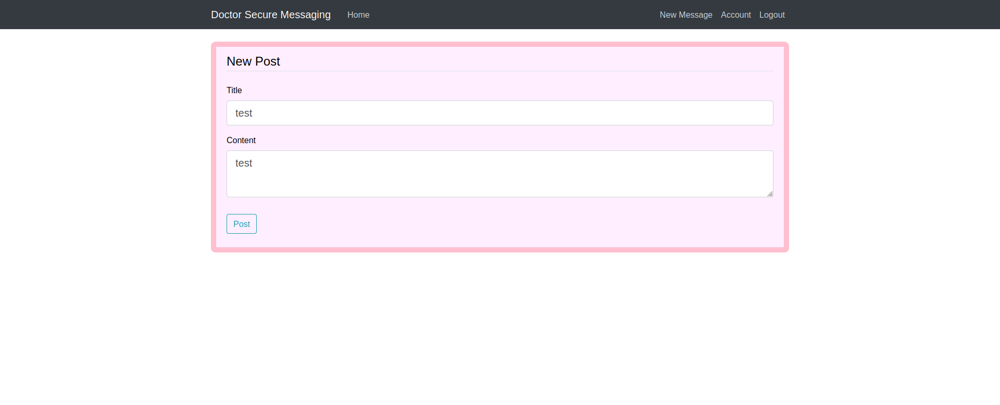

When i create a new post the title is reflected on http://doctors.htb/archive.

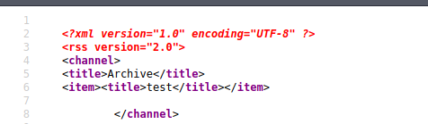

# User

So i [tested](https://github.com/swisskyrepo/PayloadsAllTheThings/tree/master/Server%20Side%20Template%20Injection#methodology) for SSTI. The template used is Jinja2. So i created a post with a payload 
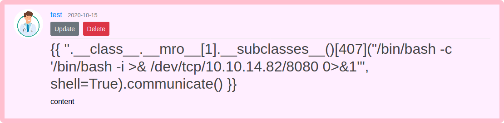

and got a revshell as user **web**.

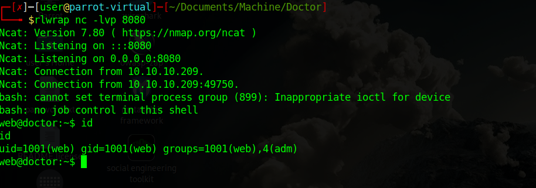

The user web belogns the group **adm** so i can read log files.
In  `/var/log/apache2` there is a **backup** file and inside found the credential for the user **shaun**

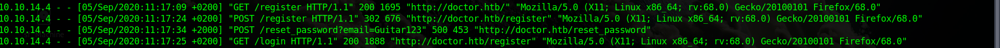

So i login as shaun (i used a [script](./exploit.py) for obtain shell)

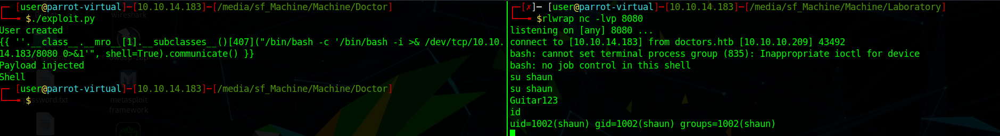

and take the user flag.

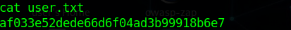

# Root
For the root there is a [exploit](https://github.com/cnotin/SplunkWhisperer2) for Splunk. 

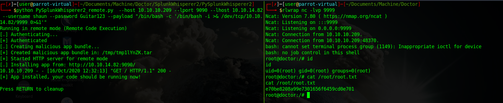

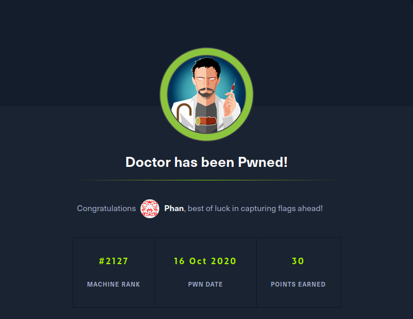
