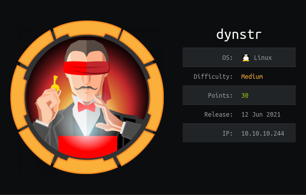

Dynstr is a Linux machine. The IP of the box is 10.10.10.244.

# Recon

I starting with *nmap* scan `nmap -A -T4  10.10.10.244`

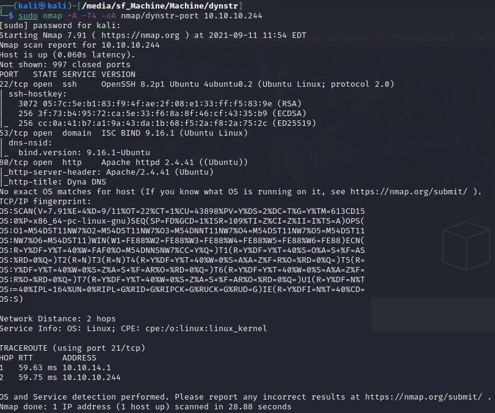


And i found:
- *ssh*
- *DNS*
- *webserver Apache*

On port 80 we got this homepage


and there are some info


The are:
- A service of dynamic DNS and use the same syntax of no-ip.com
- Three domains (dnsalias.htb, dynamicdns.htb, no-ip.htb)
- Credentials for beta mode user:dynadns password:sndanyd

So i added the three subdomain, start checking the [no-ip API](https://www.noip.com/it-IT/integrate/request) and test some request.

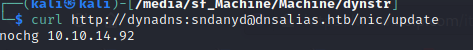

The API work so i can focus on next step, and i start trying to inject some chars like `;`

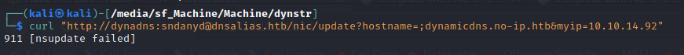

The response this time return `911 [nsupdate failed]` so was execute the [`nsupdate`](https://linux.die.net/man/8/nsupdate) utility on the host. A this point i can try to execute arbitrary comand.


And got a shell with the following payload  \`echo “base-64-payload” | base64 -d | bash\`

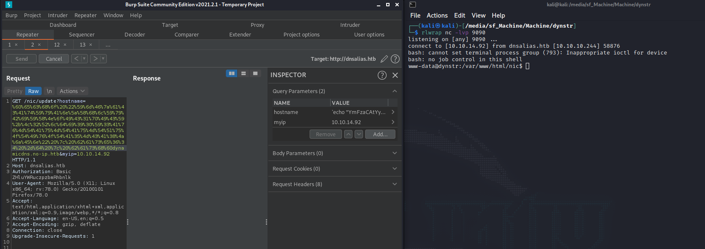

# User

There are two user `dyna` and `bindmgr`. I checked the bindmgr home and found a directory `support-case-C62796521`. Inside this directory, there are four files and in one of them(strace-C62796521.txt) there is a dump of a priv key.

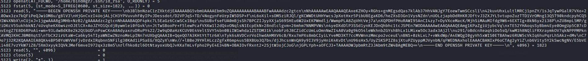

Now checking the authorized keys 

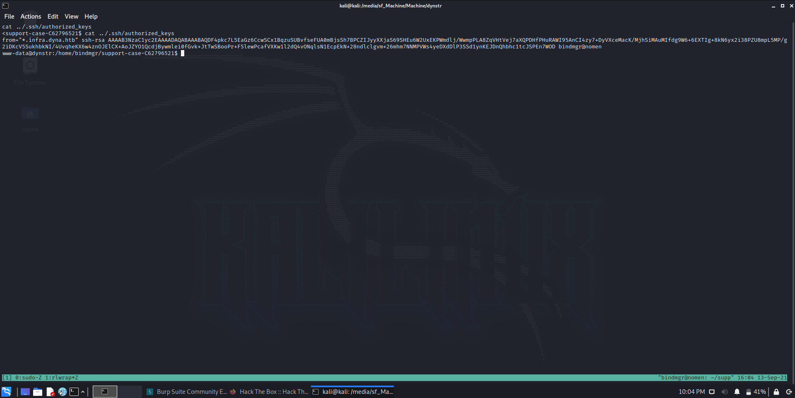

found the field `from="*.infra.dyna.htb"` 

From sshd man:

>UseDNS - Determines whether IP Address to Hostname lookup and comparison is performed
Default value is No which avoids login delays when the remote client's DNS cannot be resolved
Value of No implies that the usage of "from=" in authorized_keys will not support DNS host names but only IP addresses.
Value of Yes supports host names in "from=" for authorized_keys. Additionally if the remote client's IP address does not match the resolved DNS host name (or could not be reverse lookup resolved) then a warning is logged.

So i need to connect from a IP that resolve the DNS. For this i need to update the DNS with `nsupdate`.


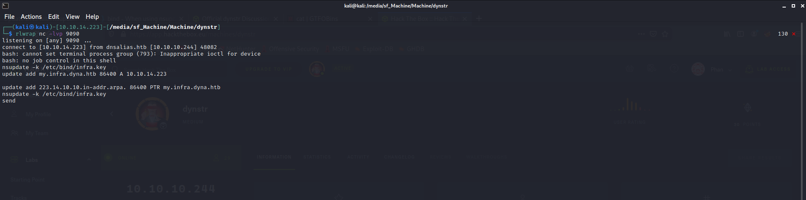

In this way i added  my IP in the `infra` zone, and now can connect with `ssh` 

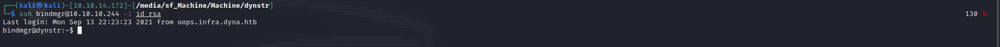

and take the user flag

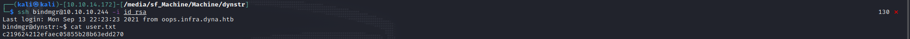


# Root

I launched `sudo -l` and i get

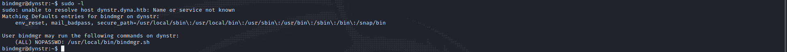

So i checked `/usr/local/bin/bindmgr.sh`

```bash
#!/usr/bin/bash                                                                                                                                                                                                                              
                                                                                                                                                                                                                                             
# This script generates named.conf.bindmgr to workaround the problem                                                                                                                                                                         
# that bind/named can only include single files but no directories.                                                                                                                                                                          
#                                                                                                                                                                                                                                            
# It creates a named.conf.bindmgr file in /etc/bind that can be included                                                                                                                                                                     
# from named.conf.local (or others) and will include all files from the                                                                                                                                                                      
# directory /etc/bin/named.bindmgr.                                                                                                                                                                                                          
#                                                                                                                                                                                                                                            
# NOTE: The script is work in progress. For now bind is not including                                                                                                                                                                        
#       named.conf.bindmgr.                                                                                                                                                                                                                  
#
# TODO: Currently the script is only adding files to the directory but
#       not deleting them. As we generate the list of files to be included
#       from the source directory they won't be included anyway.

BINDMGR_CONF=/etc/bind/named.conf.bindmgr
BINDMGR_DIR=/etc/bind/named.bindmgr

indent() { sed 's/^/    /'; }

# Check versioning (.version)
echo "[+] Running $0 to stage new configuration from $PWD." 
if [[ ! -f .version ]] ; then
    echo "[-] ERROR: Check versioning. Exiting."
    exit 42
fi
if [[ "`cat .version 2>/dev/null`" -le "`cat $BINDMGR_DIR/.version 2>/dev/null`" ]] ; then
    echo "[-] ERROR: Check versioning. Exiting."
    exit 43
fi

# Create config file that includes all files from named.bindmgr.
echo "[+] Creating $BINDMGR_CONF file."
printf '// Automatically generated file. Do not modify manually.\n' > $BINDMGR_CONF
for file in * ; do
    printf 'include "/etc/bind/named.bindmgr/%s";\n' "$file" >> $BINDMGR_CONF
done

# Stage new version of configuration files.
echo "[+] Staging files to $BINDMGR_DIR."
cp .version * /etc/bind/named.bindmgr/

# Check generated configuration with named-checkconf.
echo "[+] Checking staged configuration."
named-checkconf $BINDMGR_CONF >/dev/null
if [[ $? -ne 0 ]] ; then
    echo "[-] ERROR: The generated configuration is not valid. Please fix following errors: "
    named-checkconf $BINDMGR_CONF 2>&1 | indent
    exit 44
else 
    echo "[+] Configuration successfully staged."

    # *** TODO *** Uncomment restart once we are live.
    # systemctl restart bind9
    if [[ $? -ne 0 ]] ; then
        echo "[-] Restart of bind9 via systemctl failed. Please check logfile: "
        systemctl status bind9
    else
        echo "[+] Restart of bind9 via systemctl succeeded."
    fi
fi
```


> cp .version * /etc/bind/named.bindmgr/

 The comand above copy all content of current directory in `/etc/bind/named.bindmgr/` and i can abuse this comand by copying the bash and set the `setuid` and creating a file called `--preserve=mode`. In this way we will not lose the setuid for bash 


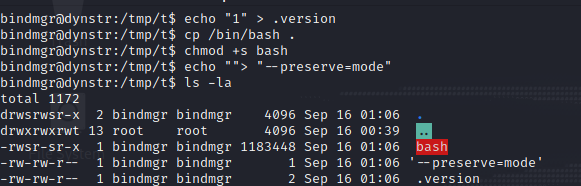

execute

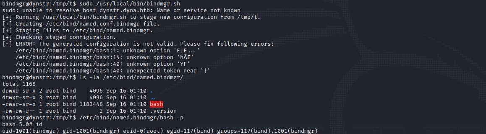


and grabb the flag

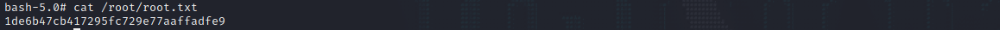


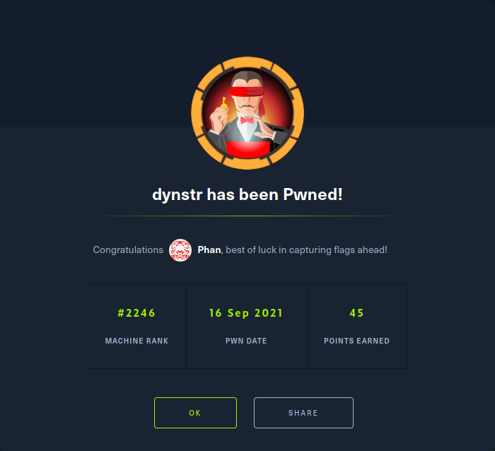
