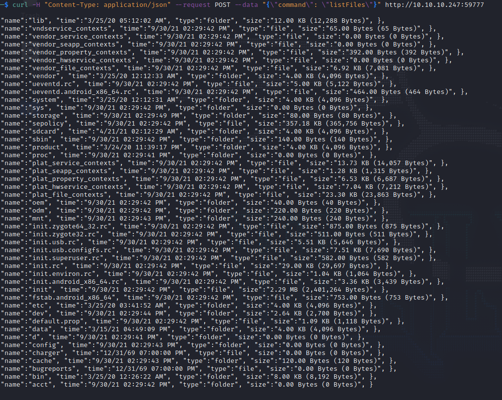
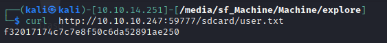

Explore is a Android machine. The IP of the box is 10.10.10.247.

# Recon

I starting with *nmap* scan `nmap -A -T4  10.10.10.247`

And i found only two open port:

- *2222*
- *5555*

On port 2222 there is a ssh server(SSH-2.0-SSH Server - Banana Studio) and after google-fu found that port [5555](https://dev.to/exadra37/android-devices-being-shipped-with-tcp-port-5555-enabled-1ig5) is the adb(Android Debug Bridge) port and cannot be accessed.

So i checked all port

`nmap -p- -T4 10.10.10.247`

and found that the port *59777* is open and related to *ES File Explorer*.

# User

There is this [article](https://medium.com/@knownsec404team/analysis-of-es-file-explorer-security-vulnerability-cve-2019-6447-7f34407ed566) that explain the vulnerability and how to exploit.

So i start to gather device info

and search some interesting file on **root** 

`curl -H "Content-Type: application/json" --request POST --data "{"command":"listFiles"}" http://10.10.10.247:59777`

and **SDcard**

`curl -H "Content-Type: application/json" --request POST --data "{"command":"listFiles"}" http://10.10.10.247:59777/sdcard`

and i found the user flag

# Root

On `/sdcard/DCIM` found several photos

and credential

`kristi:Kr1sT!5h@Rp3xPl0r3!`

So i tested the creds on ssh

and they have worked.

Now port forwading the port 5555 and connect with adb

and gain root

and grab the flag

