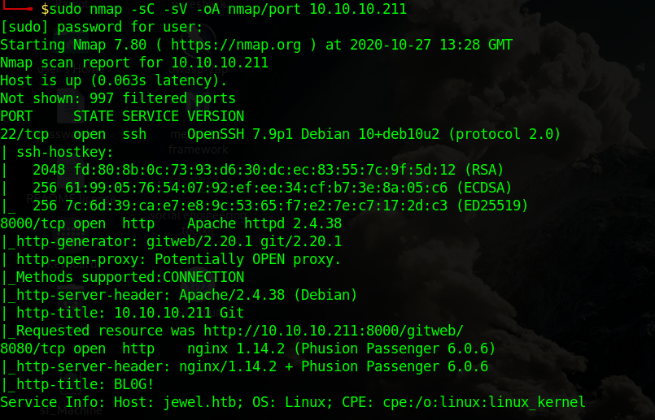
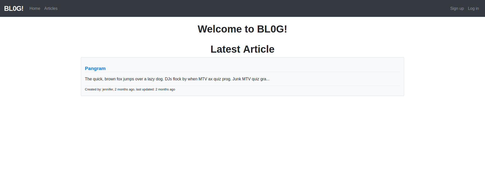
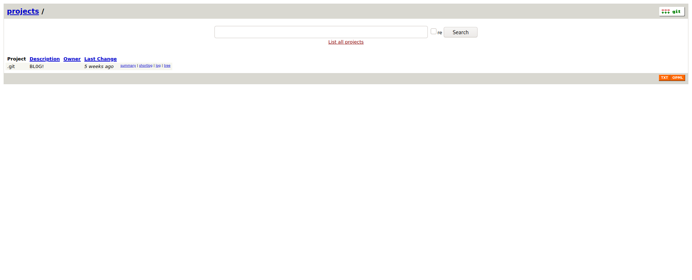
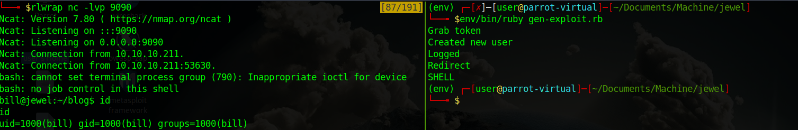
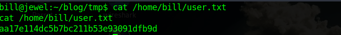
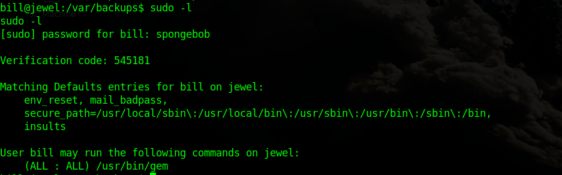
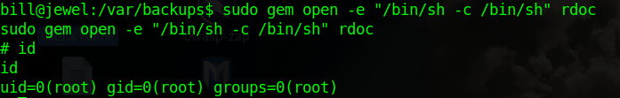
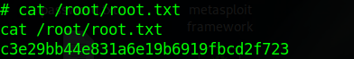
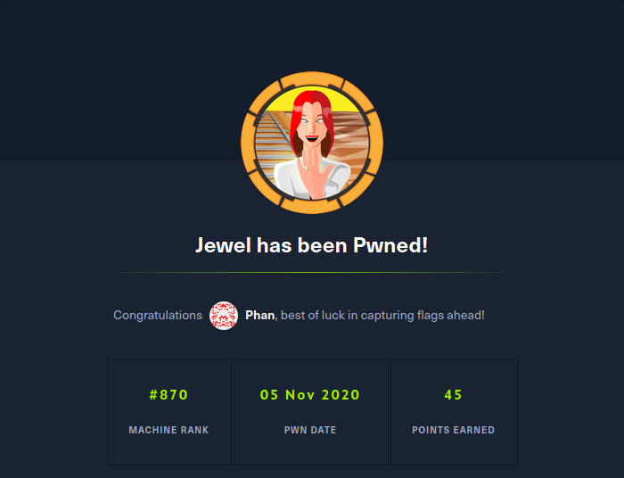

Jewel is a Linux machine. The ip of the box is 10.10.10.211.

# Recon

I starting with *nmap* scan `nmap -sC -Sv -oA nmap/cache 10.10.10.211`




And I found three services:
- *ssh*
- *webserver apache*
- *webserver nginx*

On the webserver nginx there is a blog page

while on webserver apache there is a git page with the source of blog.


So I navigate on git page for search some usefull info. In this way i recover the hash of bill and jennifer but cannot crack and info on technologies.
The blog is developed in ruby(2.5.5) and use redis for store  the user info. After some research found a vulnerability for ruby 2.5.5 and redis.

# User
The vulnerability:

>There is potentially unexpected behaviour in the MemCacheStore and RedisCacheStore where, when untrusted user input is written to the cache store using the `raw: true` parameter, re-reading the result from the cache can evaluate the user input as a Marshalled object instead of plain text.

In the this case the raw parameter is setting on function update of user(blog/app/controllers/users_controller.rb).
```ruby
  def update
    @user = User.find(params[:id])
    if @user && @user == current_user
      cache = ActiveSupport::Cache::RedisCacheStore.new(url: "redis://127.0.0.1:6379/0")
      cache.delete("username_#{session[:user_id]}")
      @current_username = cache.fetch("username_#{session[:user_id]}", raw: true) {user_params[:username]}
      if @user.update(user_params)
        flash[:success] = "Your account was updated successfully"
        redirect_to articles_path
      else
        cache.delete("username_#{session[:user_id]}")
        render 'edit'
      end
    else
      flash[:danger] = "Not authorized"
      redirect_to articles_path
    end
  end
```
So the vulnerability parameter is `username`. Some POC is avaible on https://hackerone.com/reports/413388 and https://github.com/masahiro331/CVE-2020-8165

For exploit this vulnerability I need to create new user on `Blog` page and `edit` the user info. For simplify i developed a [script]('./gen-exploit.rb')(the script need the right version of ruby) for obtain a rev shell.



And in this way got the rev shell as `bill`  and take user flag.



# Root

Starting enum and found a interesting file in bill's home. The file is  `.google_authenticator`

>2UQI3R52WFCLE6JTLDCSJYMJH4
" WINDOW_SIZE 17
" TOTP_AUTH

and is used for 2fa authentication and founded in `/var/backups/dump_2020-08-27.sql` a different backup of db. This time can crack the hash for bill with `johntheripper`. And got

> **username:bill and password:spongebob**

A this point I tryed `sudo -l`



(for verification I had to generate new code from google app `Authenticator` for generate the right OTP I had to insert new entry with this code `2UQI3R52WFCLE6JTLDCSJYMJH4`)

the `sudo -l` show the `(ALL : ALL) /usr/bin/gem` on  [GTFOBins](https://gtfobins.github.io/gtfobins/gem/) found `sudo gem open -e "/bin/sh -c /bin/sh" rdoc` for obtain a root shell.



and got root flag





