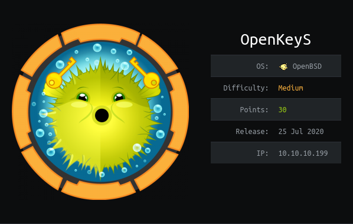

OpenKeyS is a BSD machine. The ip of the box is 10.10.10.199.

# Recon

I starting with *nmap* scan `nmap -sC -Sv -oA nmap/openkeys 10.10.10.199`

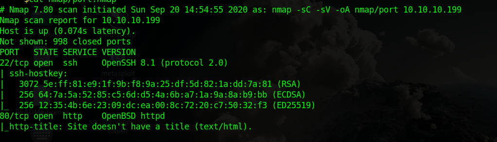

and discovers 2 services:
- *ssh*
- *webserver*

On the web page there is a login page

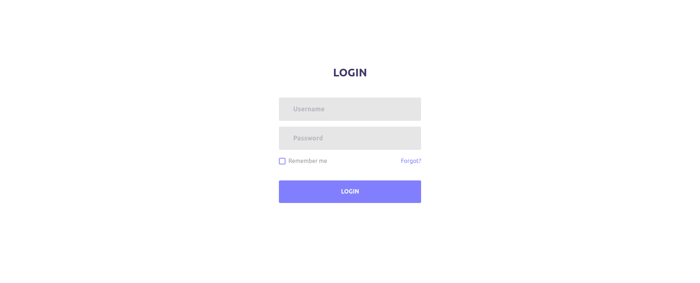

and start enumeration with `gobuster`
>gobuster dir -u 10.10.10.199 -w /usr/share/wordlists/dirb/common.txt 

and got 

>/css (Status: 301)
>/fonts (Status: 301)
>/images (Status: 301)
>/includes (Status: 301)
>/index.php (Status: 200)
>/index.html (Status: 200)
>/js (Status: 301)
>/vendor (Status: 301)

So i navigate on `http:10.10.10.199/include`

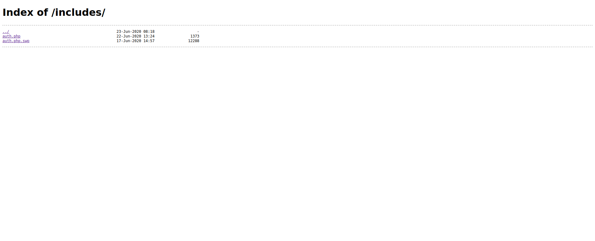

and found 2 files and downloaded them. In `auth.php.swp` 

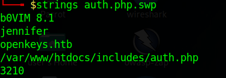

i found a username `jennifer` and with vim
>vim -r auth.php.swp

I was able to recover the script
```php
<?php

function authenticate($username, $password)
{
    $cmd = escapeshellcmd("../auth_helpers/check_auth " . $username . " " . $password);
    system($cmd, $retcode);
    return $retcode;
}

function is_active_session()
{
    // Session timeout in seconds
    $session_timeout = 300;

    // Start the session
    session_start();

    // Is the user logged in? 
    if(isset($_SESSION["logged_in"]))
    {
        // Has the session expired?
        $time = $_SERVER['REQUEST_TIME'];
        if (isset($_SESSION['last_activity']) && 
            ($time - $_SESSION['last_activity']) > $session_timeout)
        {
            close_session();
            return False;
        }
        else
        {
            // Session is active, update last activity time and return True
            $_SESSION['last_activity'] = $time;
            return True;
        }
    }
    else
    {
        return False;
    }
}

function init_session()
{
    $_SESSION["logged_in"] = True;
    $_SESSION["login_time"] = $_SERVER['REQUEST_TIME'];
    $_SESSION["last_activity"] = $_SERVER['REQUEST_TIME'];
    $_SESSION["remote_addr"] = $_SERVER['REMOTE_ADDR'];
    $_SESSION["user_agent"] = $_SERVER['HTTP_USER_AGENT'];
    $_SESSION["username"] = $_REQUEST['username'];
}

function close_session()
{
    session_unset();
    session_destroy();
    session_start();
}


?>
```
# User
The PHP script makes use of `/auth_helpers/check_auth` to authenticate users, and i can download the file from http://10.10.10.199/check_auth, which is an OpenBSD shared object. 

There are several [CVE](https://www.qualys.com/2019/12/04/cve-2019-19521/authentication-vulnerabilities-openbsd.txt?_ga=2.58244398.587934852.1575530822-682141427.1570559125) for Authentication in OpenBSD.

A useful CVE is `CVE-2019-19521: Authentication bypass`
For exploit this vul i need to insert as username `-schallenge`

So i added in the login form `-schallenge` as username and `password` as password

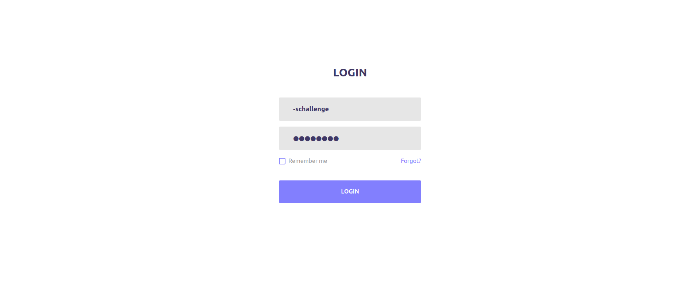

and intercpet the request with `BurpSuite` for add `;username=jennifer` in the cookie header.

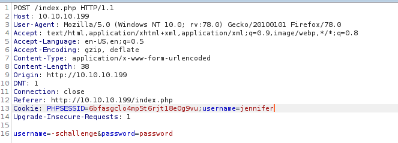

and got ssh key for the user `jennifer`

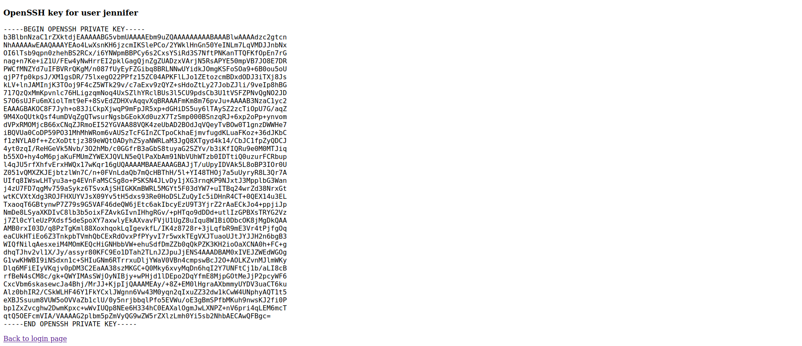

So just login with ssh 

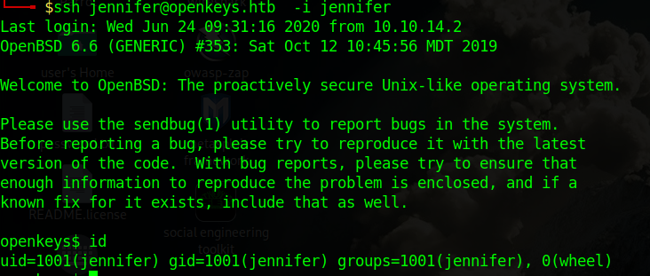

and grab the user flag.

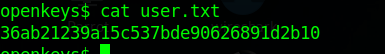


# Root

Checking the version of system 

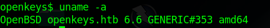

and found thath this version is vulnerable to [CVE-2019-19520: Local privilege escalation via xlock](https://www.qualys.com/2019/12/04/cve-2019-19521/authentication-vulnerabilities-openbsd.txt?_ga=2.58244398.587934852.1575530822-682141427.1570559125)

So just use the [exploit](https://raw.githubusercontent.com/bcoles/local-exploits/master/CVE-2019-19520/openbsd-authroot)

and got `root` user

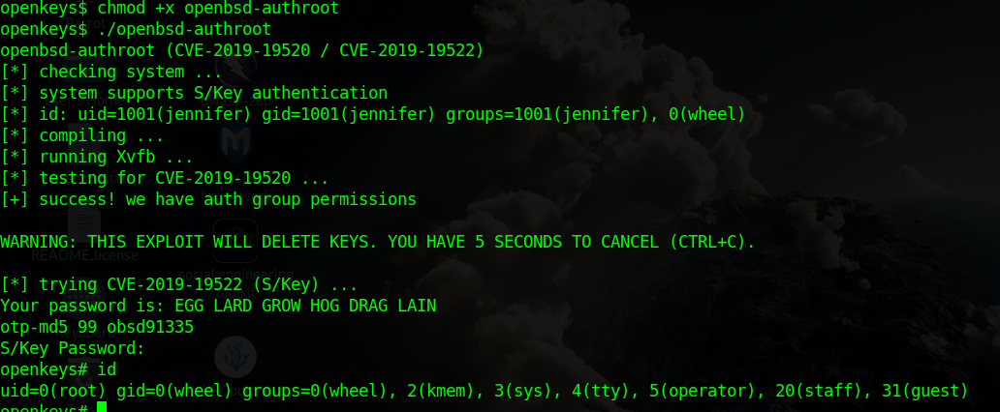

and root flag

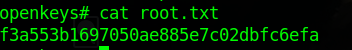

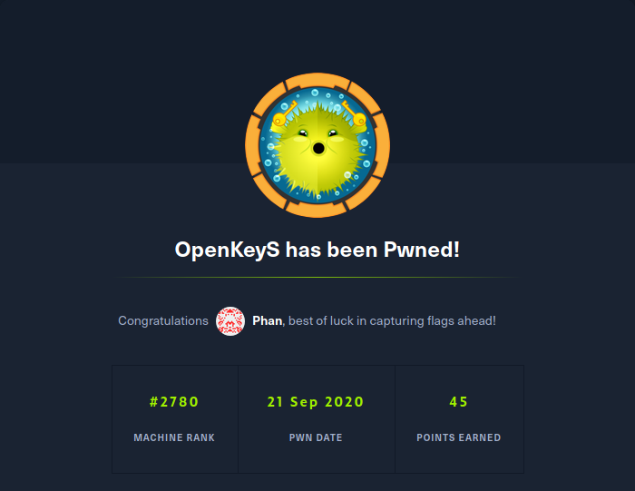
