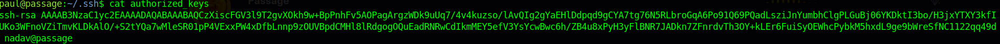
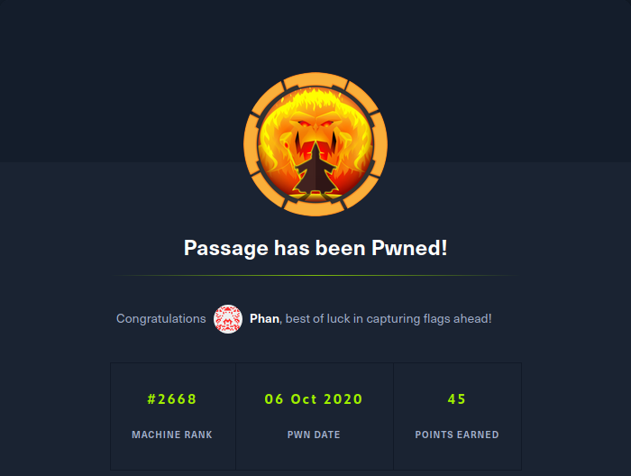

Passage is a Linux machine. The ip of the box is 10.10.10.206.

# Recon

I start with `nmap -sC -Sv -oA nmap/passage 10.10.10.206`


And I found two services:
- *ssh*
- *webserver apache*

On port 80 we got this homepage.


The home page cite the implementation of *Fail2Ban* so cannot enum with tools like gobuster. So I enum manually and find in *http://passage.htb/CuteNews/* a login page


The CuteNews is a CMS and the version running on this host is `2.1.2`
This versione of CuteNews is vulnerable. For exploit this version just register a new user 


and on redirect page upload a php shell


The shell must have the magic byte `GIF8;` after the upload of the shell open a listener in local  and go on  *http://10.10.10.206/CuteNews/uploads/avatar_phan_rev.php*(phan = user name used during the registration phase, rev.php = file uploaded).

Upgrade shell and start enum.


# User

In `/var/www/html/CuteNews/cdata/users` there is a  `lines` file with different base64 coded strings. 

The string
```
YToxOntzOjQ6Im5hbWUiO2E6MTp7czoxMDoicGF1bC1jb2xlcyI7YTo5OntzOjI6ImlkIjtzOjEwOiIxNTkyNDgzMjM2IjtzOjQ6Im5hbWUiO3M6MTA6InBhdWwtY29sZXMiO3M6MzoiYWNsIjtzOjE6IjIiO3M6NToiZW1haWwiO3M6MTY6InBhdWxAcGFzc2FnZS5odGIiO3M6NDoibmljayI7czoxMDoiUGF1bCBDb2xlcyI7czo0OiJwYXNzIjtzOjY0OiJlMjZmM2U4NmQxZjgxMDgxMjA3MjNlYmU2OTBlNWQzZDYxNjI4ZjQxMzAwNzZlYzZjYjQzZjE2ZjQ5NzI3M2NkIjtzOjM6Imx0cyI7czoxMDoiMTU5MjQ4NTU1NiI7czozOiJiYW4iO3M6MToiMCI7czozOiJjbnQiO3M6MToiMiI7fX19
```
contains info on user paul
```json
a:1:{
    s:4:"name";
    a:1:{
        s:10:"paul-coles";
        a:9:{
            s:2:"id";s:10:"1592483236";s:4:"name";s:10:"paul-coles";s:3:"acl";s:1:"2";s:5:"email";s:16:"paul@passage.htb";s:4:"nick";s:10:"Paul Coles";s:4:"pass";s:64:"e26f3e86d1f8108120723ebe690e5d3d61628f4130076ec6cb43f16f497273cd";s:3:"lts";s:10:"1592485556";s:3:"ban";s:1:"0";s:3:"cnt";s:1:"2";
        }
    }
}
```
A this point i can crack the password and obtin the credential for user `paul`.


> user:**paul** password: **atlanta1**

and i got user flag


# Root

#### Lateral Movement
In authorized_keys there is `nadav` entry

so I can log in as nadav user with `ssh nadav@passage`


Now i launch linPEAS and found the bin `dbus` with the SUID setted


there is a exploit for dbus

https://unit42.paloaltonetworks.com/usbcreator-d-bus-privilege-escalation-in-ubuntu-desktop/

so just follow the article and execute 

>gdbus call --system --dest com.ubuntu.USBCreator --object-path /com/ubuntu/USBCreator --method com.ubuntu.USBCreator.Image /home/root/.ssh/id_rsa /a.txt true


in this way just grabbed rsa key for user root.
Log in as root and grab flag



