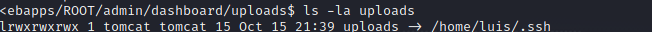
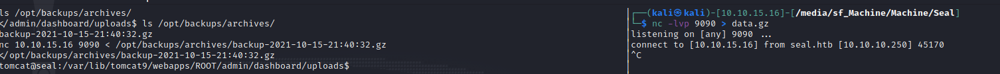
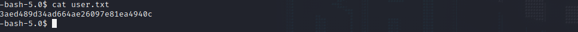

Seal is a Linux machine. The IP of the box is 10.10.10.250.

# Recon

I starting with *nmap* scan `nmap -A -T4 -oA nmap/seal 10.10.10.250`


And I found three services:
- *ssh*
- *webserver nginx on 443*
- *webserver on 8080*

On port 443 thre is a static webpage.


while on port 8080 there is a login page for gitbucket.


I can signup and then navigate between repositories 


In the repo `seal_market` in the file `tomcat-users.xml` i found a old commit with the credentials of tomcat. 


**Credentials**: tomcat:42MrHBf\*z8{Z%

So i tried some default pages of tomcat like `10.10.10.250/host-manager/text` and got the login box.


So i inserted the credentials found before and got a 403.


After a little bit of research i found the following [article](https://www.acunetix.com/vulnerabilities/web/tomcat-path-traversal-via-reverse-proxy-mapping/) that explain a vulnerability of tomcat with a reverse proxy. So if i go `https://seal.htb/manager/..;/manager/html` i can login and go in the Application Manager of tomcat.


# User

So now i can craft a reverse shell with msfvenom


Upload it from webpage


and intercept the request with Burp for add `..;` inside the path


And i got shell as `tomcat` user


After the enum i found a cronjob for ansible-playbook


the playbook (/opt/backups/playbook/run.yml) is the following

```yml
- hosts: localhost
  tasks:
  - name: Copy Files
    synchronize: src=/var/lib/tomcat9/webapps/ROOT/admin/dashboard dest=/opt/backups/files copy_links=yes
  - name: Server Backups
    archive:
      path: /opt/backups/files/
      dest: "/opt/backups/archives/backup-{{ansible_date_time.date}}-{{ansible_date_time.time}}.gz"
  - name: Clean
    file:
      state: absent
      path: /opt/backups/files/
```

The playbook copy the content of `/var/lib/tomcat9/webapps/ROOT/admin/dashboard` in `/opt/backups/files` and `copy_links=yes` from the doc: 

>Copy symlinks as the item that they point to (the referent) is copied, rather than the symlink.

So i can create a symlink the  `.ssh` folder of the user `luis`


Check if the sym link is created.


I wait for the start of the cron and pass the archive on local machine 



and extract the archive


Now can login as `luis`


and grab the the flag




# Root

Now i launch `sudo -l`


and found that is possibile execute `ansible-playbook` so i checked on [GTFOBins](https://gtfobins.github.io/) and found how exploit it


and grab flag


