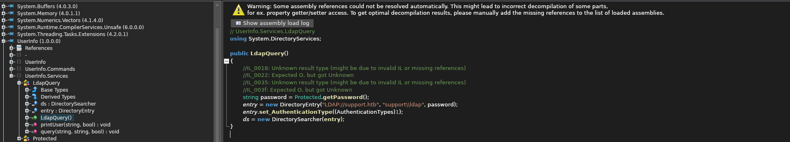

Support is a Windows machine. The IP of the box is 10.10.11.174.

# Recon

I starting with *nmap* scan `nmap -sV -sC  -oA nmap/support 10.10.11.174`

and there are open the standard port for Windows DC.

Is possible access without credential to share 

and access to the directory `support-tools` 

# User
Inside the directory there is an archive `UserInfo.exe.zip` by extracting the content and analyze it with `ILSpy` is possible find the credential for the user `ldap` inside the classes `ldapquery` 

and `protected`

The password is encrypted and is necessary to run the function `getPassword()` and obtain the password `nvEfEK16^1aM4$e7AclUf8x$tRWxPWO1%lmz`.

With the credentials of the user `ldap` is possible to access to LDAP and retrive the credential for the user `support`

and access with winrm and grab the flag

# Root

I retrived the infos on DC with `bloodhound-python`

By analyzating the output with `bloodhound` the user have the right `GenericAll` over the computer `DC.SUPPORT.HTB` so following this [link](https://bloodhound.readthedocs.io/en/latest/data-analysis/edges.html#genericall) is possible obtain full control of a computer object can be used to perform a resource based constrained delegation attack.

With `powermad` and `powerview` was added a new computer and created a new ACE to insert inside the field `msDS-AllowedToActOnBehalfOtherIdentity`

Successively was request a Service Ticket and got exection as `Administrator`

and the flag

